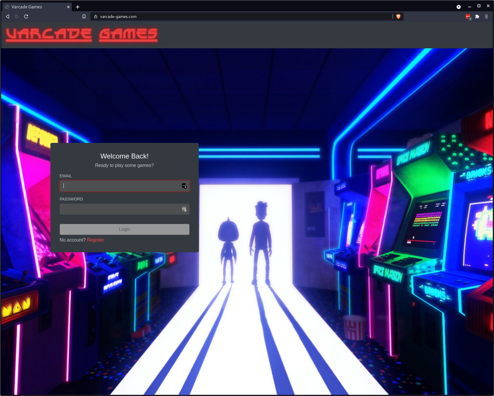
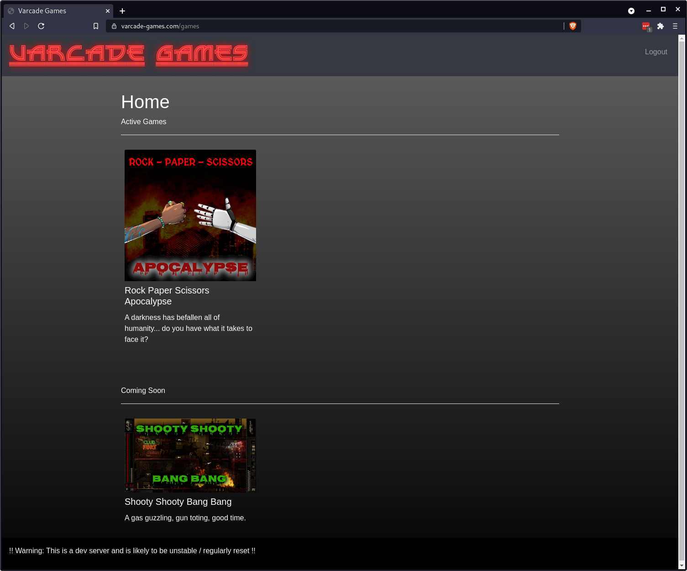
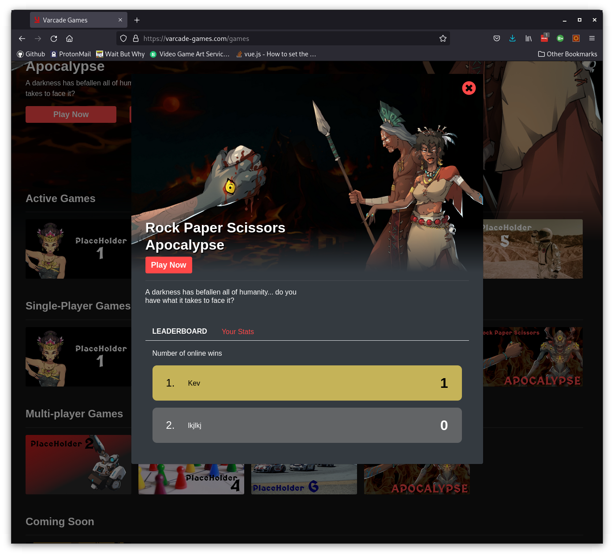
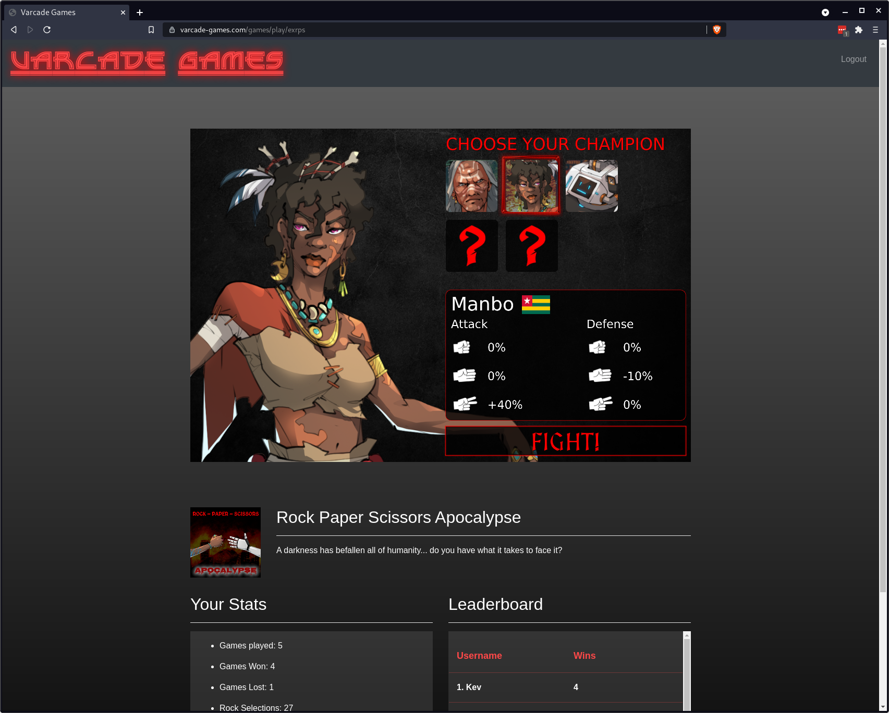
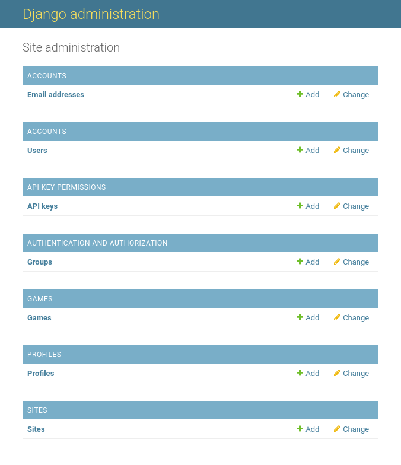

# Varcade Games



Varcade Games is an online gaming portal with a built in matchmaker, leaderboards and player stat tracking. 





Developers can build an share single and multi player games, which can be published to the portal for players to play.



You can check out an active dev server [here](https://varcade-games.com). 

**Note:** This dev server is deployed to a K8S cluster, but it is small in order to keep it cheap - so it will likely be unstable under load. 

It is also not entirely secure, so don't use real personal information, any real looking email will work for registration. This server will also be periodically wiped).

***

Having said all that, Varcade Games is not a real product...

Its real purpose is to serve as a software engineering sandbox.

A real world project that anyone can use to:

* Learn the craft of software engineering
* Explore different languages and technologies

It has a lot of what you might expect from a modern web project:

* Web tech
    - Vue.js
    - Node.js
    - Websockets
* Server tech
    - Python - Django, Flask
    - Redis
    - Stateless and stateful
* A sample game
    - Phaser 3 (Javascript)
    - Single player and multi player
* Containerized distributed services
* Build scripts
* Automated tests
* Load test
* Static analysis tools

## But what is it?

The project itself consists of:

* Game portal
    - client and server
    - dynamically configurable
    - admin panel
* A sample game
    - can be embedded in the game portal
    - this is a real and polished game, with a story line, progressive difficulty etc...
    - includes a game server for realtime multiplayer gaming
* A matchmaker
    - a basic matchmaker to allow players face off against each other online
* A stats tracker
    - the game portal has built in leaderboard and players stats
* Tooling
    - A bunch of scripts, docker files and makefiles to make running all of this easy


The goal was for it to be small and simple enough that anyone can learn the ins and outs of how it works, but scalable and flexible enough to improve and extend.

For junior engineers it should serve as a 'next step' after learning to write a bit of code. It should help you understand how to build real world software.

For more experienced engineers it offers a playground - a place to try out new tech and ideas. For example - when learning a new language you could replace some of these project components in your language of choice. This should help to experience a real world application of the language.

## Getting setup up

In order to set up Varcade Games you will need:

* Docker
* Docker compose
* Make

# Building the applications

Clone the project then from your terminal, open the `build_tools` directory:

```bash
cd varcade_games/build_tools
```

Now run the following command:

```bash
echo "ENV_CODE_OVER_TIME_ROOT=<path to the repo>/varcade_games" > .env.local
```

This file tells the build scripts where the code is.

## Building Varcade Games

To build the project simply run this command from the `build_tools` directory:

```bash
make build
```

This will likely take a few minutes...

***

## Running the applications

All we need to do now is run `make start` from the Ubuntu terminal.

That will start up all of the applications and you can check their state by running `make ps`.

If any of the services fail to start, run `make start` again (game-portal will likely fail to start as it depends on the DB starting up first). 

Next, add the following line to the end of your hosts file:

```bash
127.0.0.1   varcade.local api.varcade.local games.varcade.local matchmaker.varcade.local rps.varcade.local
```

## The Varcade Games database

Next we need to set up the game portal database. 

You will need to connect your shell to the running game-portal container:

```
docker exec -it game-portal bash
```

Next run the following:

```
./manage.py migrate
./manage.py createsuperuser
```

You will be prompted to enter an email, username and password. You can enter anything you like at this point - but remember the details, as you will need those credentials to log in to the admin panel for Varcade Games.

You're all done here, so you can close this session on the docker container by typing `exit` and hitting return, or ctrl+c.

### Running the client

You should now be able to log in to Varcade Games.

Navigate your browser to `localhost:8002` to view the Varcade Games client.

You can log in here using the credentials that you provided in the previous step where you ran `./manage.py createsuperuser`.

There is, however, not much to look at.

In order to see some content we can add a placeholder game.

### Adding a game

Navigate your browser to `localhost:8000/admin`.

You should be greeted by a login page. Use the credentials that you provided in the early step where you ran `./manage.py createsuperuser`.

Once you've logged in you should see a menu that looks like this:



Click the `add` link under the `GAMES` category.

Fill in all of the fields with dummy data, for example:

* Game id: test_game
* Name: My Game
* Desc: A great game that you should play!
* Client url: empty
* Cover art: Upload the file `exrps_cover.png` from `game_rps/client/assets/`
* Stats config: Upload the file `exrps_stats.json` from `game_rps/client/assets/`
* Game type: SinglePlayerOnly
* Game State: Coming Soon

Hit save to create the game. 

We selected `Coming Soon` for `Game State` because we don't actually want to hook up a real game. This allows us to add a placeholder.

### Viewing your game

Navigate your browser back to `localhost:8002` again.

You should now see your new game in the `Coming Soon` section.

To add an actual game that you can play and play with others head over to the [game_rps project](game_rps/README.md) and follow the instructions there.

