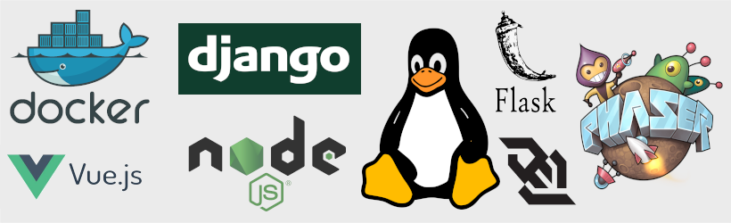

# Code Over Time


## What is Code Over Time?

Code Over Time is all about software engineering. It’s about building production ready software that can be maintained and extended over time.

Software Engineering is a skill and it is more than just coding.

It involves managing a system as it evolves over time. That system will have many different components, all interconnected. It will behave differently when many people are using it and it will break from time to time.

There are a lot of variables at play here – a lot of tech to learn and understand.

Over the course of two decades in the software industry I’ve seen and heard of countless junior engineers experiencing explosive growth during their first six months working in the real world. I’ve also heard from many experienced engineers that they experience most growth when changing job or project.

Code Over Time aims to simulate that experience. To give you something real to work on – and to get you off the rails of coding tutorials.

Here you will have your own project to manage, features to build and bugs to fix.

There is a quote that I love, that I think sums this up nicely:

```
“Education is experience, and the essence of experience is self-reliance.”

-Merlyn, ‘The Sword in the Stone’
```

In order to be an effective Software Engineer you need to face the challenges that building and releasing real software brings. 

You can think of Code Over Time as your own personal Internship.  

A way for you to get real hands on experience, on a real product.


### Varcade Games


Varcade Games is that real world product.

It is an online gaming portal that allows game developers build and share their games while also taking advantage of built in functionality, such as a matchmaker and leaderboards.

In order to build such a product you need to build a front end and a back end. 

You need databases and realtime networking. 

You need build tools and you need to write tests.

You also need to get creative. Where there are games there are graphics, music and system design.

### The Tech



In order to work on this project we’ll primarily use Python and Javascript.

You’ll also be working with popular tech like Vue.js, Node.js, Django and Flask along with DevOps tech like Docker and Kubernetes

Everything you need to be a well rounded engineer.

### Open Source


This project is 100% free and open source. All of the code is [available on Github](https://github.com/Code-Over-Time/varcade_games). 

There are detailed READMEs there that explain how everything works. 

And of course there is this website that aims to guide you through the process of become confident enough to work on such a project.

## Who is Code Over Time for?

### Beginner - Intermediate Coders

Have you learned how to write a bit of code? Maybe done a couple of small projects and followed some courses online or completed a year or two of college?

Code Over Time is primarily for you.

The goal is to give you some hands on experience with the type of project you might actually see when you get your first engineering job.

Hopefully it also helps you uncover what you’re actually interested in. Is it server programming? Automation? DevOps? Graphics?

On this project you will get to dip your toe in a number of different specialties to see which one fits you best.

### Engineers changing field

Have you been working primarily in Java, but looking to get a Python job?

Or maybe doing a lot of front end web stuff but now want to understand exactly what is going on in the backend?

Or maybe you want to make the jumps to DevOps and need some hands on experience with Kubernetes.

With Code Over Time and Varcade Games you can build the skills you will need to do exactly that.

### Experienced engineers

Are you an experienced engineer that wants to try your hand at Python? Maybe you’ve never done web development and want to try out some of that tech.

With Code Over Time you’ve got a real project to jump into and experience those things first hand.

Maybe you're interested in learning GoLang? You can try rewriting one of the Varcade Games services in Go to experience the language with real world use cases.

Maybe you want to understand Docker a bit better – there’s plenty of opportunity for that too.

Maybe you like making games and would like to plug into and existing framework for hosting it and running multi-player games.

Basically what you’ve got is a sandbox, and sitting there on Github waiting for you.

### The Curious

Interested in tech? Patient and willing to put in hours of work?

You might find exploring Varcade Games fun.

Get in and change things, see what happens.

Hack at it and have fun.


## Who am I?

At this point you may be wondering who I am and why you should care about what I have to say.

My name is Kev and I’m a Software Engineer from Dublin, Ireland.

Well actually that might not be true anymore. At the time of writing I am VP of Engineering at Scopely (we build and publish games), and have been for some time. I still consider myself a software engineer, though it’s been a few years since I’ve been in the weeds, actively contributing code to the projects I’ve been working on. In spite of that, ‘I’m a Software Engineer’ is still the answer I always give to the question ‘What do you do?’

Earlier in my career I spent a few years working at IBM, doing some interesting stuff with developer tools and a social search engine. Then I took a pretty big leap from multi-national behemoth down to start-up land, working on mobile apps and websites in the early days of Android and IOS. While I was doing that I also built and ran my own location based Zombie game (think Pokemon Go, but with Zombies). It was called ‘Outbreak: Zombie Apocalypse’ and it turned out to be a stepping stone into the games industry. 

Shortly after I released ‘Outbreak!’ DIGIT Games opened in Dublin. A brand new start up that had ambitious plans to build cross platform strategy games. I joined their team as a game server engineer, working on their first title ‘Kings of the Realm’, which was a strategy MMO for mobile and browser.

After that I became lead server engineer on their next title, and global hit mobile game, Star Trek Fleet Command. Eventually I ended up as VP of Engineering and have had the pleasure of working with many game teams, all across the world, on a number of exciting titles.

Throughout that journey I’ve done a little bit of everything. Client and server side development. Build, deployment and operations. Product and game design. Built teams, planned work and coached engineers. I’ve also accidentally nuked live databases and done some horribly hacky things during crisis moments running live services. 


Over the years I’ve become increasingly interested in training. More specifically: effective training.

This project is a manifestation of that. I like to build things and had an itch to write some code so I spent the 2020 Covid-19 lockdown working on this in my spare time. Mostly early mornings before work and weekends.

I genuinely believe that the most effective way to get good at software engineering is to do it. And not on small sample projects, like a to-do list, but on the real thing. Most new engineers I’ve spoken to tend to see explosive growth in their first six months in the real world. That’s what I wanted to simulate here – and I think Varcade Games is a great project to do it with.

I also like music (particularly Metal) and Kettlebells.

You won’t find me on social media or anything like that... it seems like social media is bad for you… but you can email me at kev(at)codeovertime.com, apply to join the private CodeOverTime Discord channel and get hands on support working with Varcade Games from me and the CodeOverTime community.

Thanks,

-Kev
