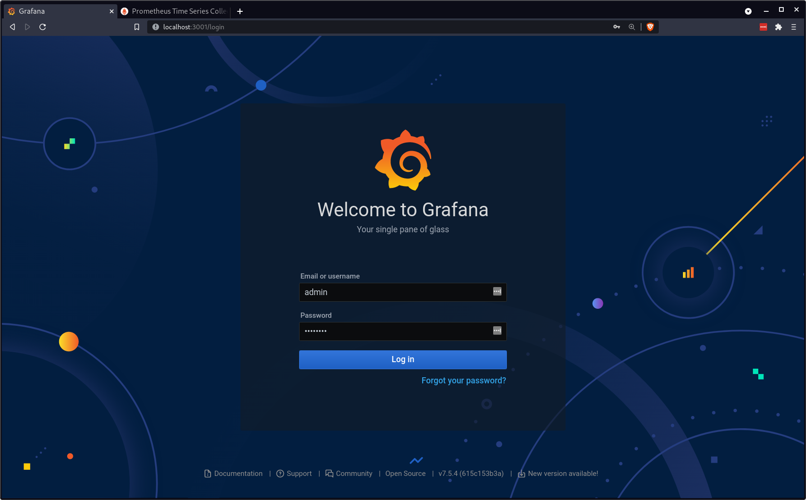
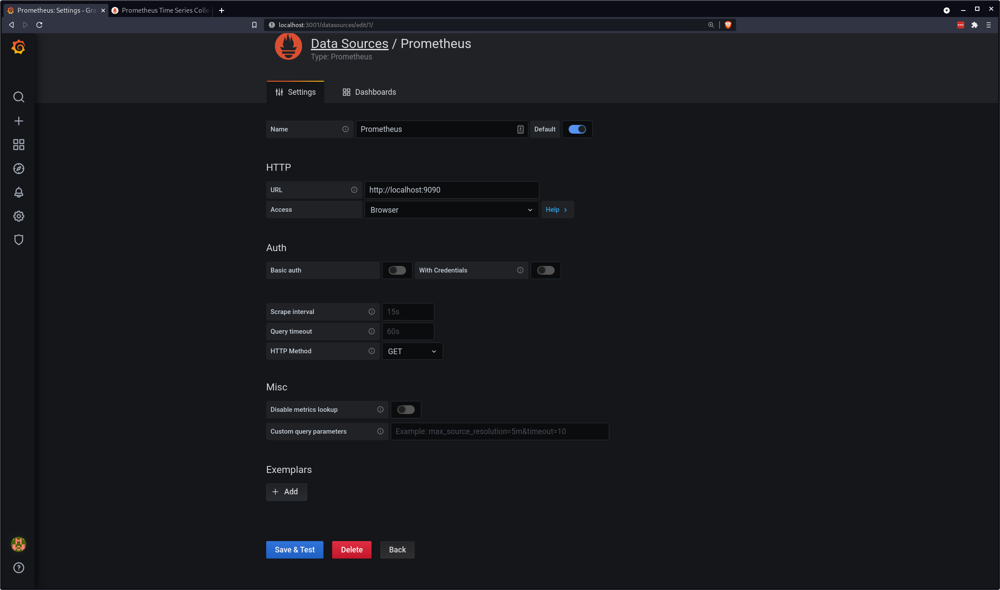
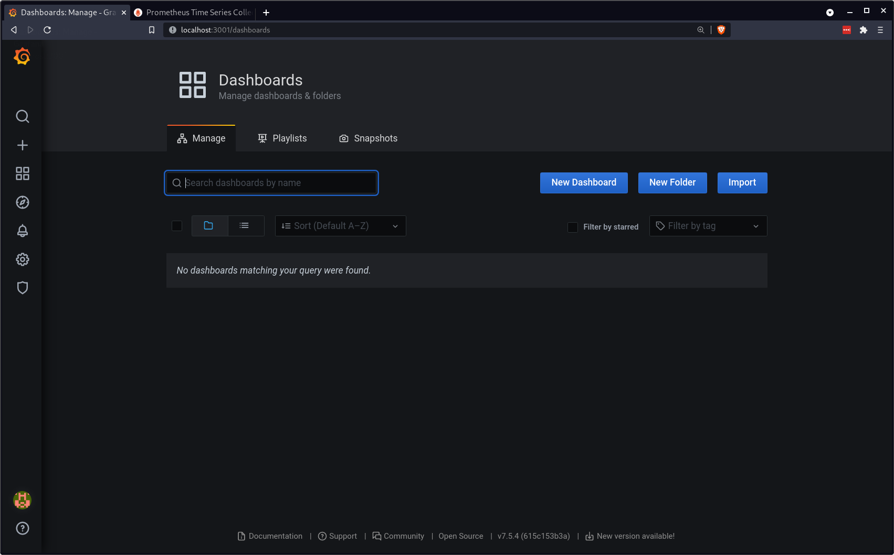
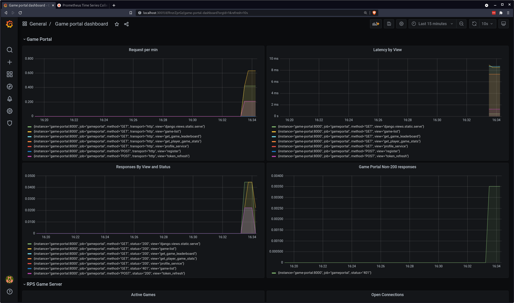
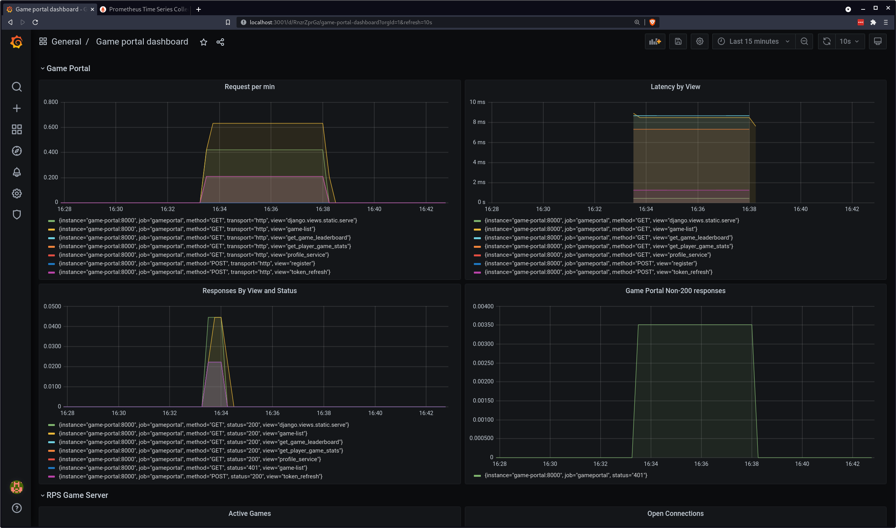

When you run `make ps` from your `build_tools` directory, there are two entries that we have yet to look at:

```bash
grafana                /run.sh                          Up             0.0.0.0:3001->3000/tcp                        
prometheus             /bin/prometheus --config.f ...   Up             0.0.0.0:9090->9090/tcp  
```

Notice that both are exposing port numbers. Grafana on `3000` and Promehteus on `9090`.

Why not try pointing your browser at `localhost:9090` and `localhost:3000` to see what's there?

***

## Prometheus

On `9090` you will see a basic interface with some text fields and buttons.

[](img/prometheus.png)

We're actually going to completely ignore this interface - but it's good that it's there, it means Prometheus is up and running.

***

##  Grafana

When you connect to `localhost:3030` you should be greeted by a screen that looks something like this (you will be running whatever the latest version is so the UI might change):

[](img/grafana_login.png)

You can log in with username `admin` and password `password`. This password is set in `build_tools/grafana/config.monitoring`.

Once we can log in we need to tell Grafana where is can find Prometheus so that it can pull metrics from there and make them look pretty.

So we need to add a data source. On the left hand side of the Grafana interface there is a cog icon:

[](img/grafana_home.png)

Click this icon to access the configuration options. Under the `Data Sources` heading select `Add Data Source` and select Prometheus from the list of options:


[](img/grafana_prometheus_source.png)

Next you will have the option to specify some options. There are three that we care about:

* URL
* Access
* HTTP Method

### URL

The URL should be set to `http://localhost:9090`. Notice that this is the port number you connected your browser to earlier. It's our Prometheus server.

### Access

Access should be set to `Browser`.

### HTTP Method

HTTP Method should be set to `Get`

Your options should look something like this:

[](img/grafana_prometheus_settings.png)

Hit the `Save and Test` button. It should turn green if everything went as expected.

If not double check your settings.

***

## Adding a Dashboard

Now that we've established a connection to Prometheus we need to start gathering some metrics and displaying them somewhere.

I have created a dashboard that you can use to get started.

First of all open up the `Dashboards` menu option and select `Manage`:

[](img/grafana_dashboard.png)

Which should display a screen that looks like this:

[](img/dash_manage.png)

On the right hand side of the screen is an `Import` button.

Click this button and then select the `Upload JSoN file` option that is presented.

The file you need to upload is in `build_tools/grafana` and is called `vcg_grafana_dashboard.json`.

Once that's done you should be presented with a screen that looks something like this:

[](img/grafana_vcg_dashboard.png)

This view is showing you the last 15 minutes worth of activity on your system, so if you haven't been using it then nothing will show up here.

Try opening up your local Varcade games at `localhost:8002` and clicking around for a while. Refresh the game list page a few times, log in, log out, player a multi-player game etc...

Once you do that you will see more activity:

[](img/grafana_dash_activity.png)

Have a read through some of the metrics. We're mostly interested in tracking things like:

* All Servers
    - Request latency (how long each request takes to process)
    - Volume of requests
    - Error responses
* Game Server
    - Number of active games
    - Number of active connections (should be at least 1 per game)
* Workers
    - Number of events processed

Have a play around on the website and see what impact it has on the metrics.

Once you've done that you will notice that a lot of the numbers are very low. It's just difficult to generate the amount of load a busy website might experience by yourself.

Next we'll look at load testing.