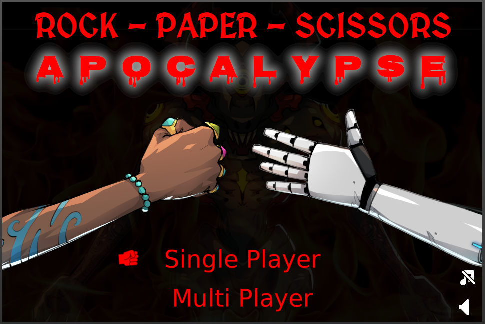

# Rock Paper Scissors Apocalypse

Hopefully by now you've played (and hopefully enjoyed playing) Rock Paper Scissors Apocalypse.

It's not a particularly advanced game - but that was not the goal. 

I didn't want to create a tech demo, I wanted to create a somewhat polished but simple product. A product that includes often overlooked parts of building a product, like end credits or a settings menu.

I also wanted to build something that could serve as a creative outlet. There are elements of visual design, game design, audio and narrative, as well as interesting tech:

* Nodejs - for our stateful game server
* Websockets - for 'realtime' game communication
* Phaser - a popular 2D game engine

In this section of the docs we will focus on `Phaser` and the single-player game mode.

Let's dive in.

