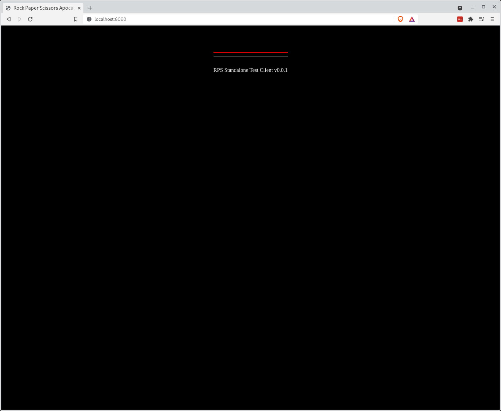

[](img/character_select.png)

## Phaser

`Phaser` is our game engine of choice.

It's a popular 2D engine with an active and engaged community that is regularly updated.

Before proceeding it's worth having a look through some of the [official documentation](https://phaser.io/learn) and getting familiar with the layout of the site - you're going to need to be able to find your way around in there.

## Prerequisites

At this point you should have your full Varcade Games stack up and running, but before proceeding let's double check.

From your `build_tools` directory run:

```bash
make ps
```

You should see something like:

```bash
        Name                      Command                State                         Ports                     
-----------------------------------------------------------------------------------------------------------------                                              
game-portal            /bin/sh -c gunicorn game_p ...   Up         0.0.0.0:8000->8000/tcp                        
game-portal-client     docker-entrypoint.sh npm r ...   Up         0.0.0.0:8002->8002/tcp                        
game-rps               docker-entrypoint.sh /bin/ ...   Up         0.0.0.0:8080->8080/tcp, 0.0.0.0:8085->8085/tcp
game-rps-client        docker-entrypoint.sh /bin/ ...   Up         0.0.0.0:8090->8090/tcp                        
gameportaldb           docker-entrypoint.sh mysqld      Up         0.0.0.0:3306->3306/tcp, 33060/tcp             
grafana                /run.sh                          Up         0.0.0.0:3001->3000/tcp                        
matchmaker             /bin/sh -c gunicorn --relo ...   Up         0.0.0.0:5050->5050/tcp                        
matchmaker-worker      /bin/sh -c python game_wor ...   Up         0.0.0.0:5051->5051/tcp                        
prometheus             /bin/prometheus --config.f ...   Up         0.0.0.0:9090->9090/tcp                        
redis-db               docker-entrypoint.sh redis ...   Up         0.0.0.0:6379->6379/tcp                        
stats-tracker          /bin/sh -c gunicorn --relo ...   Up         0.0.0.0:5000->5000/tcp                        
stats-tracker-worker   /bin/sh -c python stats_wo ...   Up         0.0.0.0:5002->5002/tcp 
```

The line you're interested in is:

```bash
game-rps-client        docker-entrypoint.sh /bin/ ...   Up         0.0.0.0:8090->8090/tcp
```

This is our dev build of the game client. Notice at the end of the line:

```bash
0.0.0.0:8090
```

This is telling us that the container is listening on port 8090... so let's try it.

Open up your browser and navigate to `localhost:8090`.

You should be greeted by this page:

[](img/test_client.png)

What we've done is basically set up a dev server that hosts the game client so that we can play and work on the game without needing to run the whole Varcade Games stack.

Our game can be built and played completely in isolation - which makes our lives a bit easier by allowing us to do more of that 'hot reloading' we saw earlier when working on the game portal.

If you want to view logs for our game client you can do so with the command:

```bash
make logs a=game-rps-client
```

My output looks like this right now:

```bash
game-rps-client         | ℹ ｢wdm｣: Compiled successfully.
game-rps-client         | ℹ ｢wdm｣: Compiling...
game-rps-client         | ℹ ｢wdm｣: Hash: d3673e4282f220a5448c
game-rps-client         | Version: webpack 4.46.0
game-rps-client         | Time: 482ms
game-rps-client         | Built at: 08/22/2021 2:19:54 PM
game-rps-client         |      Asset      Size  Chunks             Chunk Names
game-rps-client         | index.html  8.57 KiB          [emitted]  
game-rps-client         |    main.js  19.3 MiB    main  [emitted]  main
game-rps-client         |  + 86 hidden assets
game-rps-client         | Entrypoint main = main.js
game-rps-client         | [./src/scenes/fight_screen.js] 20 KiB {main} [built]
game-rps-client         |     + 155 hidden modules
game-rps-client         | Child html-webpack-plugin for "index.html":
game-rps-client         |      1 asset
game-rps-client         |     Entrypoint undefined = index.html
game-rps-client         |        4 modules
game-rps-client         | ℹ ｢wdm｣: Compiled successfully.

```

Which is telling me what a recent change to a file triggered a recompilation, which was a success.

This should feel pretty familiar - I've tried to make interactions with the various different components as consistent as possible. 

Let's try it out properly by breaking something and then fixing it.

Open up `game_rps/client/src/index.js` and comment out the second import like so:

```javascript
//import { BootScene } from './scenes/boot_scene.js'
```

Now open up your browser again. Everything should be broken, meaning you are left with a more or less blank screen:

[](img/test_client_error.png)

To understand what is going on here we need to open up the browser console again. You should see an error log that looks like this:

```
javascript
Uncaught ReferenceError: BootScene is not defined
    at eval (index.js?b635:22)
    at Module../src/index.js (main.js:1663)
    at __webpack_require__ (main.js:20)
    at Object.0 (main.js:1843)
    at __webpack_require__ (main.js:20)
    at main.js:84
    at main.js:87
```

Unsurprisingly the error is telling is that `BootScene is not defined`. 

This is because we just commented out the line of code that imports the BootScene (we'll talk about what the BootScene is soon).

Remove the comment and take another look at your browser. The page should have reloaded automatically and start working again. 

And that's it - we can now player the game on a dev client, make changes and see the impact.

Next we'll look at some of the key concepts around how we've used Phaser to create Rock Paper Scissors Apocalypse. 

***

### Notes:

Sometimes the page might not auto-reload after making a change. This could be after you add a new file (due to permission issues with your mounted directory), after you add a new dependency through NPM or if you make changes outside of the main src directory.

In this case you can restart the image by running the following from your build_tools directory: `make restart a=game-rps-client`. If that doesn't work, you may need to rebuild with `make build a=game-rps-client` before reloading.
