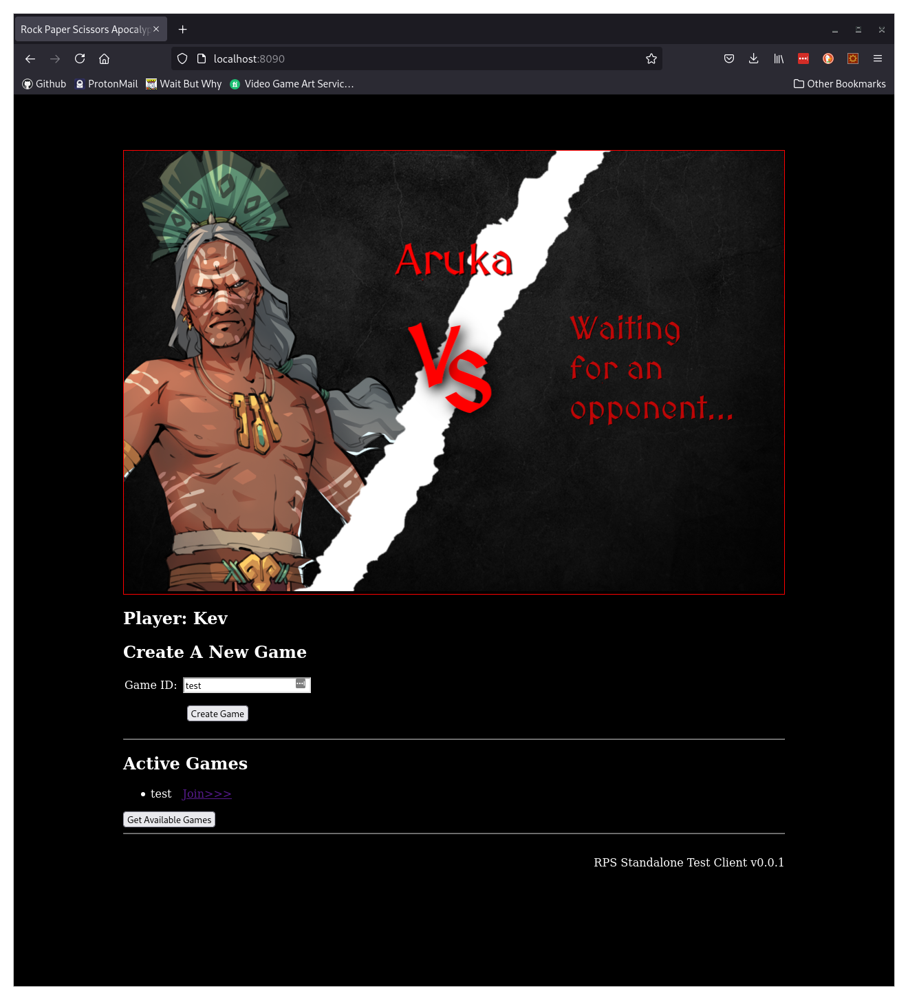

At this point you should have your Varcade Games stack running.

Point your browser at `localhost:8090` to get access to the standalone game client, just like we did earlier when we talked about single player mode.

When you select `Multiplayer` in the standalone client you get access to some additional debug UI that allows you to create your own multiplayer games, without needing Varcade Games and its matchmaker.

You will find this to be very useful for testing multiplayer functionality as it will drastically increase you ability to make changes and test those changes quickly.

## Creating a game

Select `Multiplayer` mode from the main menu and you will see a text box appear below the game. Enter a 'User id' (this can be any valid string) and hit the 'Select Name' button. 

Now you should have the option to create a game:  

Enter a game ID (again, any valid string will do - I went with 'test') then hit 'Create game'.

Once you've done this the game client should change scene over to the character selection scene. Select a character and you should see this:

We're halfway there...

### Joining a game

Next open up a new tab in your browser and navigate to `localhost:8090`.

Select `Multiplayer` mode, just like before, and enter a different User id.

Once you submit your user id you should see a list of available games to join under 'Active Games':

Click the join link to join the game. This should cause the client to transition to the character select scene.

Once you select your character, both clients should update and show the VS scene, then the game.

Here I have set up two browser windows side by side so I can play against myself:

Give it a try! 

Once you've played a game or two also try refreshing one or both of the browser windows. What happens if the host disconnects? What happens if the person that joined disconnects?

It's worth spending a bit of time playing around and breaking things here.
