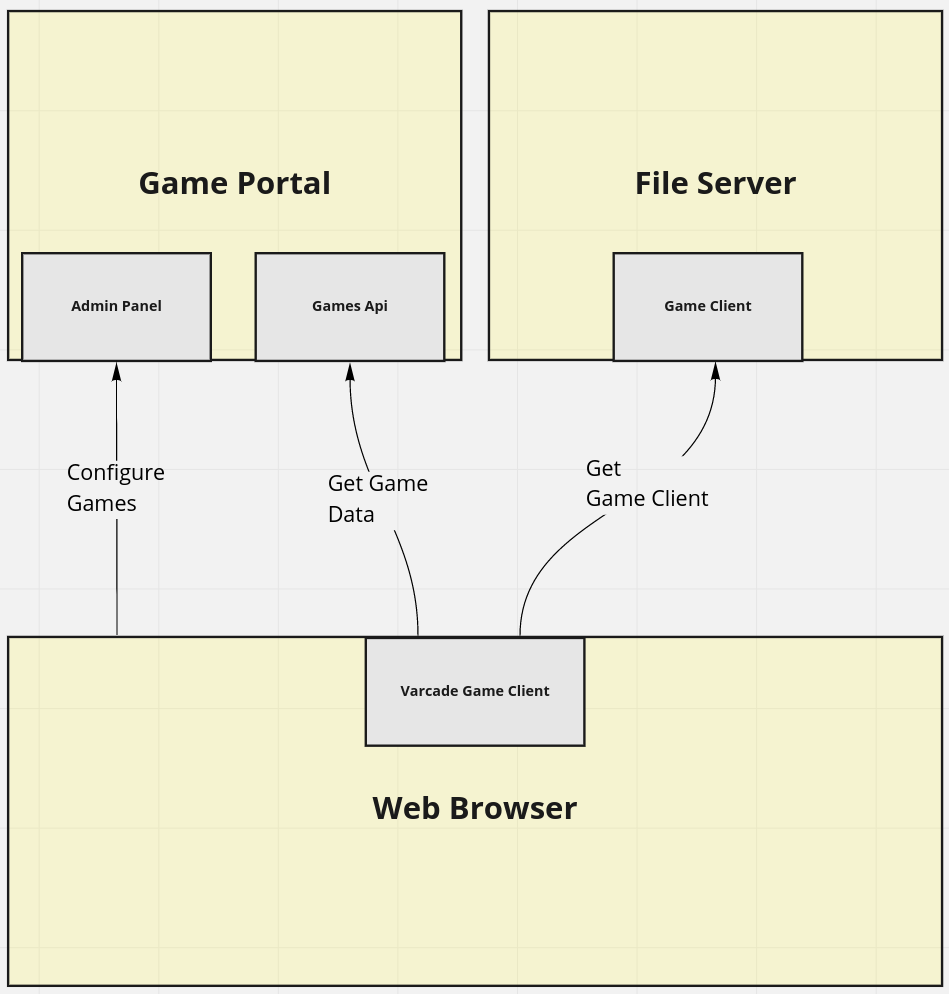

# Embedding Games

Before we dig into the details of how games are loaded via the web UI, let's have a look at the process from a high level.

[](img/embedding_games_flow.png)

Take a second to digest that image.

We have multiple servers in play:

* Game Portal
    - Used to configure games via admin panel
    - API to serve active games to players
* File Server
    - This is where players download the actual game from.

Taking this step by step, the following is happening:

1. Using a browser, we configure a game through the Admin Panel
2. We run the Varcade Games client (our Vue.js project) in the browser
    - We did this by navigating to `localhost:8002`
3. The Varcade Games client fetches the game data from the Game Portal
4. The Varcade Games client uses that game data to download the game client from a file server
    - The URL we added to the game we configured in the Admin Panel is this file server
5. The Varcade Games client runs the game
    - The game is a single javascript file, which we will look at in more detail later

## The Games API

If you've already been exploring the `networking` section of the [browser dev tools](/varcade_games/reverse_engineering/) then you may have already seen this request:

```
Request URL: http://api.varcade.local:8000/games/v1/games/
```

This is step 3 from the list above.

The response to this request looks something like this:

```json
{
    "count":1,
    "next":null,
    "previous":null,
    "results":[
        {   
            "game_id":"exrps",
            "name":"Rock Paper Scissors Apocalypse",
            "desc":"An fun but intense fighting game based on rock paper scissors. Single player and multi player modes available.",
            "client_url":"http://localhost:8090/main.js",
            "cover_art":"http://api.varcade.local:8000/media/images/exrps_cover_Wsyt72t.jpg",
            "banner_art":"http://api.varcade.local:8000/media/images/exrps_banner.jpg",
            "stats_config":"http://api.varcade.local:8000/media/stats_config/exrps_stats.json","game_state":"ACT"
        }
    ]
}
```

A couple of things should look familiar here.

First off - all of that information is exactly what we put into the Admin Panel when we configured the game. It is all of the information needed by the Varcade Games client to display a game.

Secondly, there are a couple of URLs in there.

* http://api.varcade.local:8000/media/images/exrps_cover_Wsyt72t.jpg
* http://api.varcade.local:8000/media/images/exrps_banner.jpg
* http://api.varcade.local:8000/media/stats_config/exrps_stats.json

Remember the Django [settings file](/varcade_games/admin/#the-setting-file) from the previous section on the Admin Panel?

This is our `MEDIA_ROOT`.

Once we have all of the data we need from the Games API we can go ahead that display a game to the user.
 
## Loading games in the client

Open up `website/client/src/views/GamePlay.vue`.

This is the game page - where you will have played Rock Paper Scissors Apocalypse. 

Looking at the HTML, there are three main components on this page:
```html
<wp-active-game :selected-game="selectedGame"/>
...
<wp-player-stats :selected-game="selectedGame"/>  
...
<wp-game-leaderboard :game-id="gameId"/>
```

These are custom Vue components. We have one that presents our game, one that presents the player statistics for the game and another that presents the leaderboard for that game.

Let's have a look at `wp-active-game`, it's at: `website/client/src/components/wp-active-game.vue`.

If you scroll down to the code section of the file you will find this function (slightly modified for brevity):

```javascript
loadGameData: function () {
    if (this.gameScriptLoaded()) {
        console.log('Will not load game - it appears to be loaded already')
    }
    else{
        let gameScript = document.createElement('script');
        gameScript.setAttribute('src', this.selectedGame.client_url);
        gameScript.setAttribute('type', 'text/javascript');
        gameScript.setAttribute('id', `_game_instance_${this.gameId}`)
        document.body.appendChild(gameScript);

        this.loadingInterval = setInterval(() => {
            console.log("Game loading...");
            const gameContainerElement = document.getElementById('gameContainer') 
            this.gameLoaded = gameContainerElement != null && 
                gameContainerElement.firstChild != null
            if (this.gameLoaded) {
                clearInterval(this.loadingInterval);
                console.log("Game loaded.");
            }
        }, 500);
    }
}
```

This is where we load the game.

All we're doing is using javascript to add a new tag to the HTML page. This new tag is a `script` tag, and in that script tag we specify the URL of the game client. 

There is also some code that runs every 500 milliseconds to check if the initial loading of the game is complete, so that it can update the UI.

And that's it for how the game is loaded - until of course we dig into how the game actually works.

Before that - there is another hook we should take a look at.

The Matchmaker.


