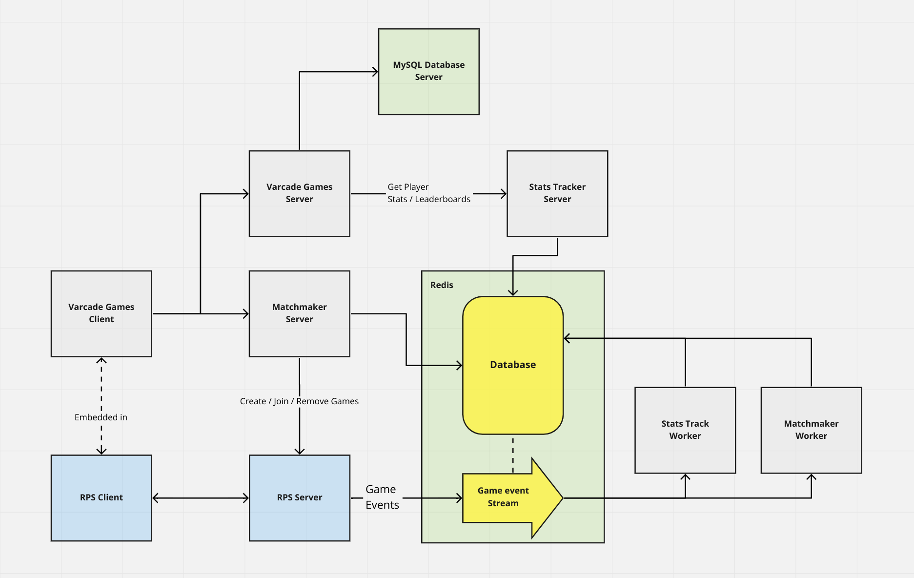
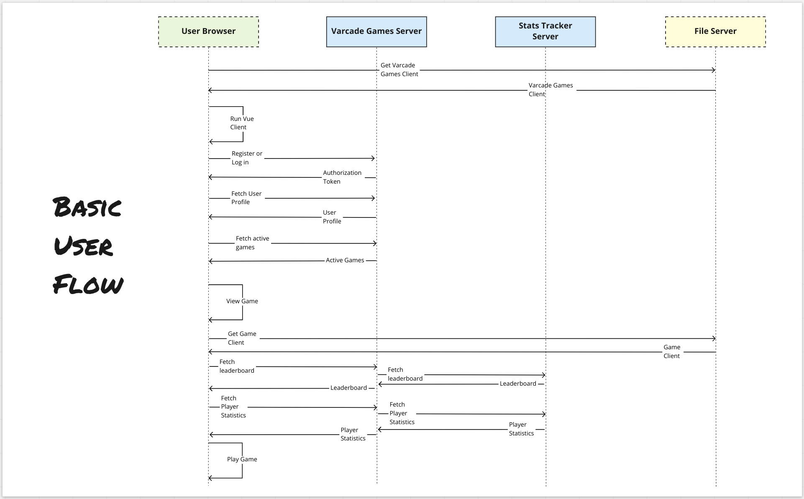

# System Architecture

At this point you should have your local development environment all set up and you should be able to log in to your own private instance of Varcade games and play `Rock Paper Scissors Apocalypse`.

So let's have a look at the big picture - what's actually going on behind the scenes.

In the above diagram I have colored all of the components that make up Varcade Games in grey. 

The green boxes (Redis and MySQL) are third party dependencies. Varcade Games needs them to operate, but they exist as independent products built by someone else.

And finally, in blue is our actual game. Rock Paper Scissors Apocalypse. This game has nothing to do with Varcade Games, technically at least. It is plugged into the system, but the system doesn't need it to operate. The game doesn't need Varcade Games to function either. It is using it as a host.

I'll briefly introduce the various components here before we dig more deeply into how they work and how to work with them.

## Components

### Varcade Games Client & Server

The first box on the left hand side center of the diagram is our Varcade Games Client.

This is what the user interacts with. Where they log in, browse games and select games to play. 

This client is built using [Vue.js](https://vuejs.org/), so there is a lot of Javascript, HTML and CSS in there.

The client connects to a dedicated Varcade Games server. This server is responsible for managing player accounts and managing games.

It is built using [Django](https://www.djangoproject.com/), so we'll be working in Python on the server side. It also uses MySQL as a database to store the player account and game information.

### Player Stats Server

In our diagram we can see that the Varcade Games Server connects to something called the 'Stats Tracker' server.

This server's job is to serve leaderboards and interesting statistics to the game portal. 

Each game page will have a metrics and leaderboard section, the Varcade Games client gets that information from the Varcade Games server, but that server must request the information from the Stats Tracker server first.

This server is built using [Flask](https://flask.palletsprojects.com/en/2.0.x/), which means we're working with Python.

### Matchmaker Server

The Varcade Games client also connects to the Matchmaker server.

The client has a built in Matchmaker maker UI so that players can find each other and play together.

The Matchmaker server is responsible for creating and managing multi-player games. It is generic by nature and doesn't really know anything about the games that are using it, so each game that wants to use it must be registered with it.

This server is also built using [Flask](https://flask.palletsprojects.com/en/2.0.x/), which means we're working with Python again.

### Redis

You'll notice that both the Stats Tracker and Matchmaker servers connect to [Redis](https://redis.io/), which is a no-sql database. 

Multi-player games, player stats and leaderboards are all stored in Redis. It provides a number of data structures that are useful for our particular use case. 

### The Workers

Both the Stats Tracker and Matchmaker also have 'worker' applications.

These are programs that are also written in Python whose job it is to monitor goings on behind the scenes. They track and store player stats coming from games. They clean up old games in the Matchmaker database, and much more.

Many server systems require such applications for performing any work that doesn't fit into the typical request-response model of a sever.

### RPS Client and Server

And finally, we've got our game. This is the game that we have integrated into Varcade Games, which means it is hosted by, and leverages the Matchmaker and Stats Tracker services built in to, Varcade Games.

Notice that our diagram shows a connection between the two clients. The game client is embedded in the Varcade Games client.

Notice also that the client communicates with its dedicated server in order to play against other players online, but the server also has connections to Varcade Games.

First of all, the Matchmaker needs to be able to connect to the game server in order to actually create and manage games.

Secondly, the game server needs to send 'events'  to a 'stream' in order to keep the Varcade Games system up to date. This 'stream' is more functionality in Redis that we are leveraging.

The game client is built using Phaser 3, a 2D game engine built in Javascript. This is the part the player interacts with. 

The game server is built using Node.js, which is a web server built in Javascript. 

## Interaction

Now that we've been introduced to the various different players in our systems, let's take a look at how the system actually `behaves`; how these components actually interact with each other.

To represent this visually we will use something called a 'sequence diagram'.

### Sequence Diagrams

In case you've never seen a sequence diagram before, they are essentially just a useful way of visually representing interactions between a number of components in a system over time.

For example, here is a very basic sequence diagram that shows the interactions between a customer and a cashier when buying a loaf of bread:

What a pleasant and polite interaction it was too.

All we've done here is visually represent a customer walking up to a cashier with a loaf of bread. They greet each other, then the cashier scans the bread and tells the customer how much they have to pay. The customer then counts out some cash and gives it to the cashier. The cashier then gives the customer their change before they say goodbye and go their separate ways.

The arrows that go between entities represent `communication between components`.

There are also arrows that start and end on a single entity.

In our case, when the cashier scans the bread they don't need anything from the customer. They just need to do that action themselves.

Same goes for the customer when they are counting out the money needed to pay for the bread. 

In the sections below we will expand on these concepts to understand how the different entities in the Varcade Games system interact with each other.   

### Basic Varcade Games interaction

Let's use a sequence diagram to take a look at some of the interactions you will have already had with Varcade Games.

In the below sequence diagram we have 4 entities:

* User Browser
    - This is the user's web browser, through which it is interacting with our website
* Varcade Games Server
    - This is the `server` that manages all of the Varcade Games configuration and data
* Stats Tracker Server
    - This is the `server` that manages leaderboards and player stats for our games
* File Server
    - This is a basic server that serves files

This diagram is showing us the most basic interaction that a user will have with Varcade Games.

They will:

1. Load the website
2. Log in
3. View a list of games
4. Select a game
5. Play the game

Our website is what is known as a 'client side application'. All of the interactions and layouts of our pages are managed through Javascript running in the browser.

So when you navigate to Varcade Games you first need to download that Javascript. It is stored on a server whose only job is to serve those files.

Once the browser runs the Javascript it will present the user with a log in page. As mentioned earlier, the client will connect to the Varcade Games server to log in. 

The server will give the client back a token, which it can use to fetch the player's profile and a list of currently available games.

Once it has a list of game the client can go about displaying them on the landing page that players see once they've logged in. 

A player can select an active game to play, at which point our client will fetch the leaderboard for that game as well as any statistics that are available for that player. In our case your will only see stats if you have played a Rock Paper Scissors multi-player game.

Once all of that is loaded our client can display the game page, at which point the user is free to play the game.

***

That's it for our high level view of the overall system. Later one we will see more sequence diagrams that will help us go through some of the more complex interactions within Varcade Games. For now, let's start scratching beneath the surface...