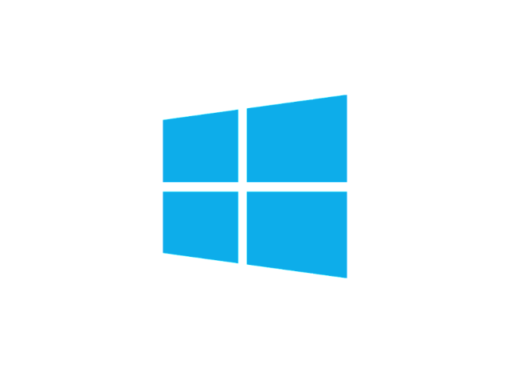
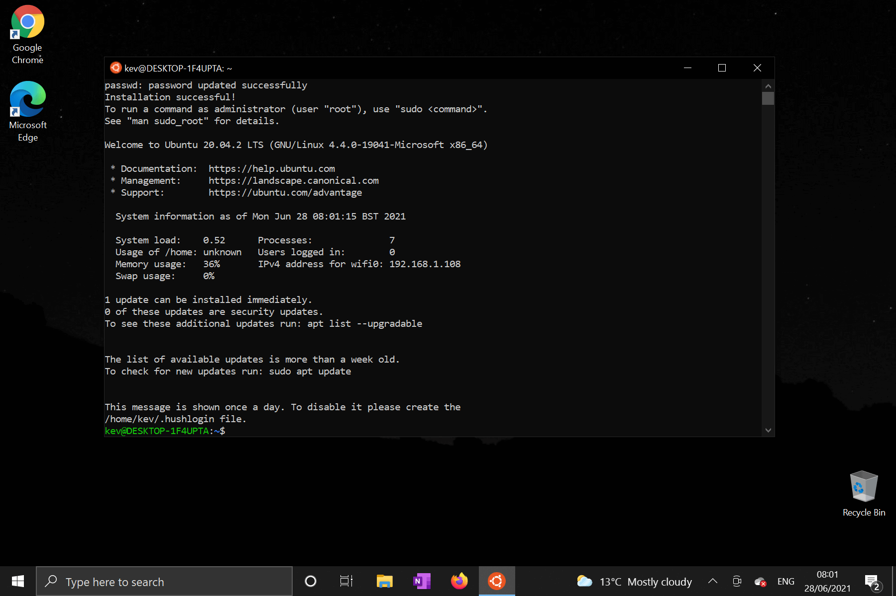

# Preparing Windows for development



To get your Windows environment we will do three things:

* Install WSL2 - Windows Subsystem for Linux. This allows you to run Linux from within Windows
* Install Docker for Windows - Docker is a virtualization based container management system.
* Install VSCode - VSCode is a popular code editor developed by Microsoft

!!! info
    On a number of occasions throughout your Windows setup you will be asked to run an application `as an administrator`. To do this type the application's name (eg. 'notepad' or 'Powershell') into the Windows search bar, right-click the menu item that appears and select `Run as administrator`.


***

## Update Windows

The first thing we will do is make sure our Windows system is up to date. Type `updates` in the Windows search bar and click the `Check for updates` option that appears.

Install all system updates - hopefully your system is up to date already and there's nothing to do here.

If you're not up to date you might have to sit through a few restarts.

***

## WSL 2

Next we need to install WSL 2, or `Windows Subsystem for Linux`. This basically allows us to run [Linux](https://en.wikipedia.org/wiki/Linux) directly within our Windows environment.

There's a great guide to setting up WSL2 in the [official Microsoft docs](https://docs.microsoft.com/en-us/windows/wsl/install-win10#manual-installation-steps). 

!!! info
    The above guide will ask you to run commands in `Windows Powershell`. You will likely want to copy and paste these commands as they can be quite long. To paste any text that you have copied into powershell simply `right-click` within the Powershell window.

Follow those steps before continuing here (up to `install windows terminal`). You can pick whichever Linux distro you like, though I recommend `Ubuntu 20.04 LTS` if you're new to Linux. 

***

## Ubuntu Setup

Once that process is done we can start setting up our Linux environment - which is where we will run the actual `Varcade Games` project.

If you correctly followed the Microsoft guide, you should already have your Linux terminal open, but if not open up the Ubuntu app (or whichever distro you installed) and get your user setup. To do this you can simply type `Ubuntu` in the Windows search bar, and select the app.

You will be greeted by a terminal, which will prompt you to enter user information:

[](img/ubuntu_setup_complete.png)

While we're here we should also install `Docker Compose` - which is a tool that helps us manage Docker containers.

Follow the official installation guide, but remember you are running this in your Linux terminal, so you need to select the Linux instructions. 

[Official install guide](https://docs.docker.com/compose/install/).

## Docker

Next install [Docker for Windows](https://docs.docker.com/docker-for-windows/install/). The default install configuration is fine for our needs, so just go with defaults - but make sure that the `Install required Windows components for WSL 2` option is checked:

[](img/docker_for_win_install_options.png)

Once the install is complete you will need to log out and back in again. Then Docker should start up automatically. It will offer you a tutorial... you can skip that, we can figure this out on our own.

!!!info
    If you are running on a low powered device (limited memory in particular), you should create a .wslconfig file to limit the amount of resources that Docker uses.

    To do this simply put a file called `.wslconfig` in your Windows home (`C:\Users\<your user name>`) directory with the following values saved in the file:

    ```
    [wsl2]
    memory=2gb
    processors=2
    ```

    You can modify the above values as needed for your environment.

***

## VSCode and Git

Next download and install [VSCode](https://code.visualstudio.com/Download) (default settings are all fine).

You will also need a [Github](https://github.com/) account - so if you haven't got one you'll need to create one now.

That's it for the installation part - most of our software dependencies are now sorted. 

To test that it's all working properly head over to [the guide for doing that](/setup/environment_setup/testing_your_setup/).

