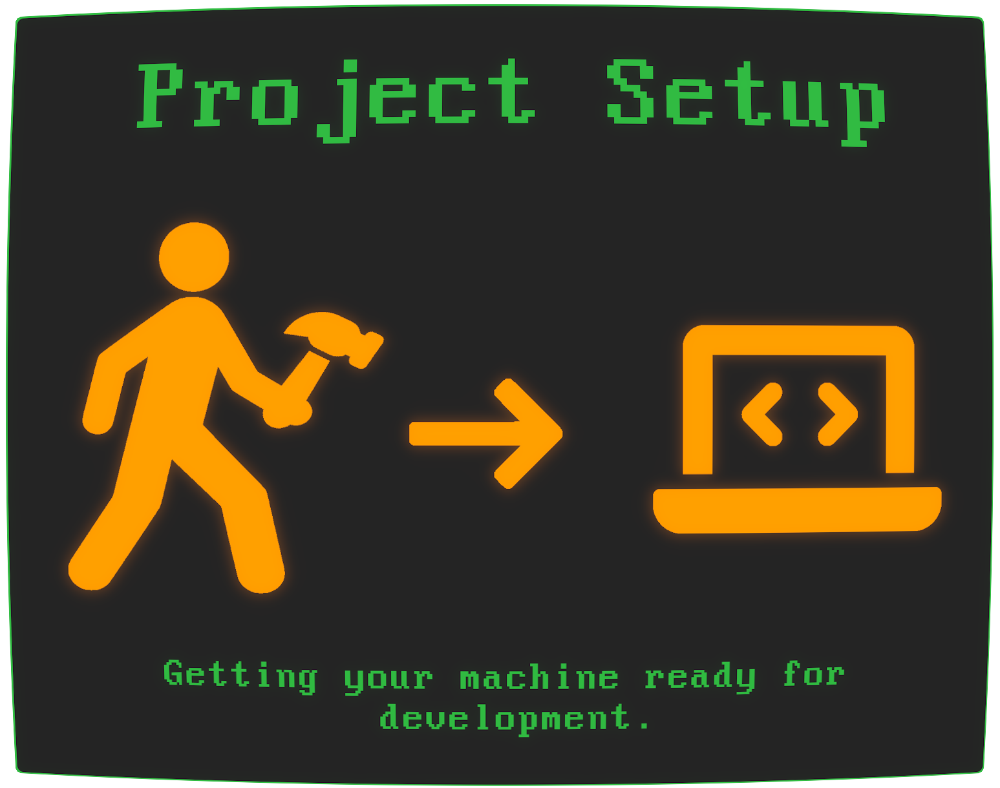

# Setting up your Dev Environment

This section will teach you how to set up your computer to run a distributed system

Code Over time aims to provide realistic hands-on experience with a real software product, and so this section covers what is typically the first thing a software engineer does during their first few days at a new company.

That is, set up their shiny new work machine and get the project they will be working on running.

This is something you **need to learn by doing**, so let's start doing.
