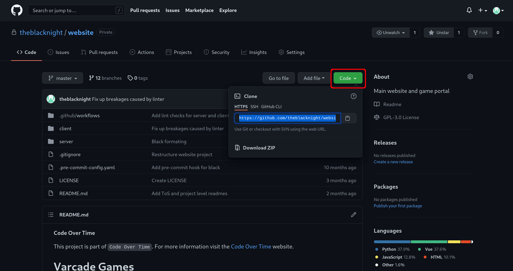

# Get the code

All of the code for Varcade Games is available via Github, meaning it is available to you right now!

Open up your terminal. If you're running Windows this will be the Ubuntu terminal that we created in the Windows setup (you can open it by typing Ubuntu in your search bar).

***

## Forking & Cloning

At this point you have two options:

1. Fork the repo
2. Clone the repo

`Forking` the repo means you'll create your own copy of the entire codebase within Github.

This is worth doing if you plan to plan to actively work on Varcade Games and want to save any changes you make to the code.

You will have your own space to work on - you will own it.

`Cloning` creates a copy of the codebase on your local machine. You will not be able to push changes back to the main repository, but you can make whatever changes you want locally.  

I recommend forking Varcade Games. It takes zero effort and you will end up with your own copy of the code that evolves over time. It also makes it easier for you to keep your changes safe and backed up in Github.

***

## Local Setup

Before we fork or clone anything, we should organize our local environment a bit.

First, create a directory to put all of the code in:

```bash
cd ~/
mkdir code
cd code
```

!!! Info
    The above commands should be run in your terminal. So in Windows you should be running this from your Linux app. For Linux and MacOS you can use your standard terminal.

The above is three distinct commands:

1. `cd ~/` - This **C**hanges **D**irectory to your home directory, which is represented by `~/`
2. `mkdir code` - This create a new directory named `code`
3. `cd code` - This **C**hanges **D**irectory to your new directory

Next we will use Git - our **Source Control Management** software of choice to actually download the code.

***

## Forking

To create a fork you need to open up the project [repository in Github](https://github.com/Code-Over-Time/varcade_games.git).

On the project page you will find a 'Fork' button at the top right of the screen:

[](img/fork_github.png)

Click that button to have Github create a copy of the repo. That copy will be stored under *your* account.

*This is the project you will be working on from here on out.* 

Once that's done you can head back over to your terminal and clone your repo to your local machine with the following command:

```bash
git clone https://github.com/<your user name>/varcade_games.git
```

This will create a new directory called `varcade_games` in your current directory and that directory contains all of the code.

Github will also provide a handy link for you to clone if you select the `Code` button from the UI:

[](img/clone_github.png)

!!! info
    You can make your project private in the settings screen, which would mean that only you can view and make changes to it. If you do this you will need to set up SSH keys to privately manage the repo. Github provides documentation on how to do this.

***

## Cloning

To simply clone the main code repositories, copy and run the following command in your terminal:

```bash
git clone https://github.com/Code-Over-Time/varcade_games.git
```

This will create a new directory called `varcade_games` in your current directory and that directory contains all of the code.

That's it.

***

## Working with the code

Now that you've got the code on your computer you are ready to start working with it.

You can use the editor/IDE of your choice, I won't judge. I used Sublime text and Vim to write all of this code. VSCode is popular with a lot of developers and is probably a good choice if you don't already have a preferred setup.

#### On Windows

Once the project is cloned you can do something pretty cool on Windows. 

Run the following command from your Ubuntu terminal (from the same directory you ran the `clone` command):

```bash
code .
```

This is a special program in the Windows Ubuntu app that will open up VSCode (we installed this on a previous step) on your local machine, but connect it to the Ubuntu instance so that you can modify the code that we just cloned directly from Windows!

***

Feel free to explore the code for a while before proceeding. There are detailed README files in each project folder and in all first level sub-folders that should help you understand what each of the different pieces is doing. 

Once you're ready to run the actual project, move on to the next section.