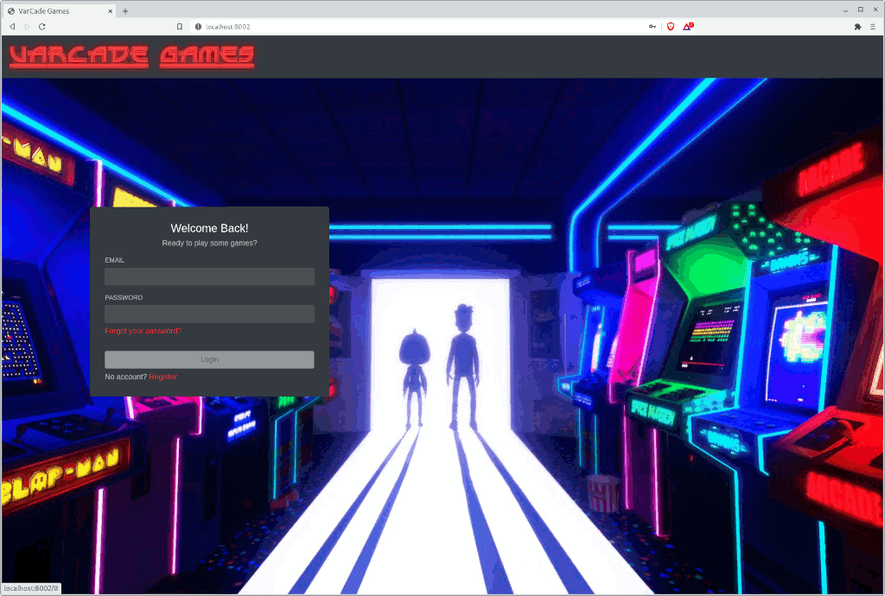

# Varcade Games

`Varcade Games` is an on-line gaming portal. 

It's a place where single and multi player Javascript games are hosted and is made up of a number of interconnected components.

This gaming portal provides 'hooks' so that other developers can build and embed games within the portal, like a built in matchmaker for multi-player games and leaderboard tracking.

In order to work with Varcade Games you'll need to setup the following components:

* The main game portal website
    - Client & server
* The Matchmaker
    - A server we use to connect players
* The Game
    - A single player and multi-player fighting game... of sorts
* The Game Server
    - A server that is plugged into the matchmaker
    - Server authoritative multi-player gaming
* The Stats Tracker
    - A server we use to create leaderboards
* Prometheus & Grafana
    - Metrics and graphs for monitoring the project
* Build tools
    - The tools needed to build and run all of the above

That might seem like a lot, but there are a bunch of handy tools at your disposal to make running all of this easy. So let's go get our hands on the code and get it running!

