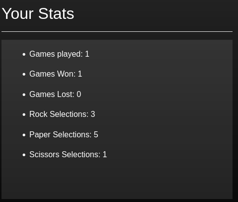

# Stats UI Design

**Category**: Web Frontend Development

**Level:** Junior

**Tag:** v0.0.1 

## Description
When you load a game in the Varcade Games web client it will display some multi-player stats for the currently logged in player (or a message telling them there are no stats if they have yet to play).

This UI is pretty boring as it stands - it simply displays a bulleted list of stats:

We need to dress this UI up a little bit, make it more interesting for the user.

You have creative control on this task - you are free to make this piece of UI more interesting however you please.

Maybe a table would be a better way to show this data? Or try aligning the numbers to the right so that they all line up and are easier to read. 

Maybe a different icon instead of the single bullet (like a game controller? We already use [fontawesome](https://fontawesome.com/) in the project, which has plenty of icons to play with).

## Deliverable
1. Updated player stats UI in the Varcade Games web client
2. This is a purely visual change

## Acceptance Criteria
* The stats UI has been updated and is more visually appealing (to you at least)

***

## Task Tips!

* In can be interesting to challenge your own creativity - software engineering doesn't have to be all technical all the time, explore creating something. Think about UI and user experience. What looks good to you? Will it look good to other people? Even if front end design is not all that interesting to you it is worth experiencing so that at the very least you can be more empathetic towards the designers you will likely end up working with some day.
* This component is located in `website/client/src/components/wp-player-stats.vue`
* Remember that this same UI is displayed for all games - so any visual changes that are specific to a single game will need to include server side work.