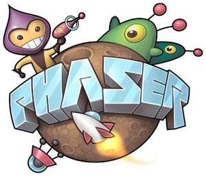

Before we jump too deep into the code, let's first go through some concepts and terminology that will be useful when describing how the game works.

## Phaser

]

The first thing you should do before looking at the game code is head over to [phaser.io](https://phaser.io/) and checking out the game engine we'll be using.

In fact, regardless of what project you start working on, or company you start working at, it's always a good idea to go read up on whatever the core technology being leveraged is.

This doesn't need to be a study session, but at the very least you should:

* Try to understand what the producers of the technology are trying to achieve
* Check out a few basic examples
* Understand the feature set of the technology
* Find the documentation

Phaser is our game engine of choice. It is a free and open source 2D game engine that is easy to use, performant and full featured.

## Scenes

A Phaser project is split into `scenes`.

When you play single player mode in Rock Paper Scissors Apocalypse the game will move through the following scenes:

* Boot 
* Loading 
* Main menu 
* Story intro
* Character selection
* Character Intro
* VS Scene 
* Fight Scene
* Post fight
    * Loop back to VS scene if winner
* Game over

We follow the traditional format for a fighting game: Select character -> face opponent -> view result -> fight next opponent or game over.

So there is a progression. You fight one character at a time until you get to the final boss, unlocking characters along the way.

Scenes are analogous to the scenes in a movie, but for a game they can be described as 'the different stages of interaction a player has with a game'.

Our game has a number of scenes to set up the game, then a scene for the actual game play, then a scene to display the results.

Each scene expects something slightly different from the user and encompasses a logical step within the game.

When working on Rock Paper Scissors Apocalypse you will spend most of your time working on the scenes.

They are all in the `game_rps/client/src/scenes` directory.

At this point it's also worth calling out a couple of scenes that are somewhat specialized.

### The boot scene

The boot scene simply loads enough of the game for us to display a loading scene. In our case it downloads a couple of fonts before transitioning to the loading scene.

The boot scene is our entry point to the game - the first scene that is run. It will simply display a black screen while loading its assets, before moving directly on to the loading scene.

We do this to minimize the amount of content we need to load before showing the player something. In our case we just need our font so that we can display some text in the loading scene.

### The loading scene

The loading scene will download all of the game assets (images, audio etc...) required to run the game. We do this up front because if we only load our assets as they are needed by the game, the game would stutter and slow down during scene transitions.

## Assets

If you open up `game_rps/client/src/assets` you will find all of the images, audio and fonts for the game. 

There is also a file in there called `asset_list.json`.

If you open up that file what you will see is basically a `manifest` that contains all of the game assets.

If you want to add a new asset to the game it can be added here. The file is broken down by scene and any new assets added simply need to be added here and referenced as needed by the code - the loading scene will take care of downloading the actual asset.

## The game engine

Our game project is actually composed of three different projects:

* Client
* Game engine
* Server

We'll ignore the server for now, but what is this game engine project?

Well - since this game is both single and multi player I decided to split out the actual gameplay logic into it's own small project that can be imported into both the client *and* server projects.

This means we have the exact same gameplay logic regardless of whether we're working on single player or multi player.

It also means we can run the game on the server side - making it harder for players to cheat the leaderboards.

The game engine contains:

* Data models for the game (Game, Player, Round, Weapon etc...)
* The data for the game (settings, story line, characters, credits etc...)
* The logic for managing a series of rounds and results

The engine is event driven, which means you can subscribe to its event system to listen out for changes in game state - which is how it gets hooked into the client and server.

We'll look at this in more detail later when we get into the actual code.

## The game engine interface

The game engine interface is a class that allows us to completely decouple our game UI from the concept of single player vs multi player.

Basically we have a graphics layer that doesn't care about the game mode being played, it just cares about making everything look and feel nice. The complexities of networking and interacting with the game engine live in the game engine interface.

One of the first things we do when starting a new game is to create an instance of this interface.

With that in mind, let's jump into the code and take a look at single-player mode.

