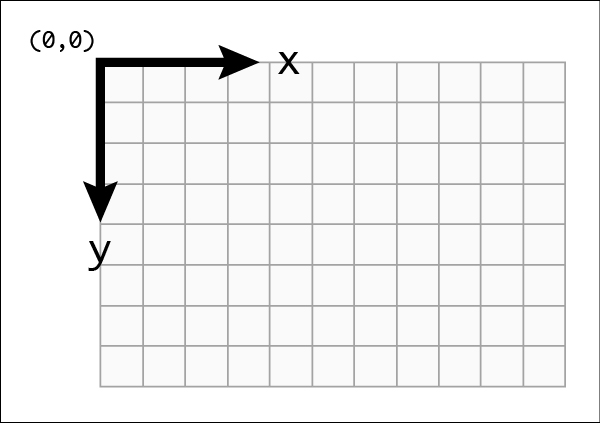

[](img/fight_scene.png)

## Working with Phaser

Phaser is a 2d graphics engine and does not come with any fancy UI or layout functionality.

When working on Varcade Games we were able to use HTML and CSS to easily lay out all of our content in a nice organized fashion.

With Phaser we're 2d graphics land, which means a Cartesian plane and a X/Y coordinates. 



The top left hand corner of the game is point X=0, Y=0. 

As we add images, test and buttons to our game we have to explicitly set their X/Y coordinates on that plane.

If you're not careful you will end up with lots of hardcoded values in your code, which can become pretty painful pretty quickly.

So, before we go any further we should check out our layout file.

### Layout

Open up `client/src/game_data/layout.js` and have a look around.

At the top we have a couple of global variables. It's useful to calculate and store screen height / width and half height / half width as they will help us position game objects relative to the screen.

For example if you want to position something in the middle of the screen you set X to half width and Y to half height. You will see these values used extensively throughout the rest of the file.

The first layout, and most straight forward layout, in the file is for the Loading scene:

```javascript
LoadingScene: {
      ui: {
        text: {
          originX: 0.5,
          originY: 0.5,
          bitmapFontId: 'verdana64',
          color: 0xFF0000,
          fontSize: 48,
          x: globalLayoutData.halfScreenWidth,
          y: globalLayoutData.halfScreenHeight
        }
      }
    },
```

So what can we infer from this?

Well it's safe to say that there is probably a loading scene. That loading scene probably has some UI and the UI looks like it has some text.

That text has a bunch of data associated with it. A lot of it should be obvious - there's an X and Y coordinate, a color, a font ID and a font size.

The only bits that might be unfamiliar are `originX` and `originY`.

You will see this used extensively through out our layout file as it is a really useful feature that Phaser has.

When positioning an object in 2d space you can specify the coordinates relative to some point on the object... this is a lot easier to explain with a diagram:

[](img/origin_coords.png)

As you can see in the image above, I am describing the position of the images in space relative to a point on the image.

If I set the origin X and Y of an image to (0, 0), then placing the image at coordinates (10, 10) will result in Phaser rendering that image with the top left corner at that point.

If I set the origin X and origin Y of an image to (0.5, 0.5), then placing the image at coordinates (40, 30) will result in Phaser rendering that image with the center at those coordinates.

Why 0.5? Because the minimum value for the origin is 0 and the maximum is 1.0. So specifying 0.5 for the origin of both X and Y represents half way of both axes. 

If this is confusing don't worry about - jump into the code and make some changes and see what happens. 

The background for the main menu scene is defined next in the layout:

```javascript
MainMenuScene: {
      ui: {
        background: {
          originX: 0,
          originY: 0,
          x: 0,
          y: 0
        }
    }
}
```

Try changing the origin X and Y to 0.5 and see what happens. 

What do you need to change X and Y to in order to fix it?

That brief introduction should be enough for you to be able to find your way around the various scene layouts - so let's move on to the code.

## The main menu

The main menu is one of the simpler scenes in the game, so we can use it to get a sense of how scenes are set up.

First off we need to create a new instance of a Phaser Scene:

```javascript
const MainMenuScene = new Phaser.Class({

  Extends: Phaser.Scene,

  initialize: function () {
    Phaser.Scene.call(this, { key: 'MainMenuScene' })
    this.menuHighlightIconIndex = 0
  },

  init: function (data) {
    this.error = data.error // This will be filled if returning from an error in another scene
  },

  create: function () {
    ...  
  }
  
  ...

}
```

You will see this same basic setup in all of our scenes. `Initialize` acts as our constructor. 

`init` is called when the scene is being started and can also be used to pass data around, as we do here. 

Finally the create function is where we actually create our scene by adding images and text etc...

Our rendering code looks like this:

```javascript
this.layoutData = getSceneLayoutData('MainMenuScene')

const bgLayout = this.layoutData.ui.background
this.add.image(
  bgLayout.x, bgLayout.y, 'mainMenuBg'
).setOrigin(
  bgLayout.originX, bgLayout.originY
)
```

This is where we add the background image for our scene.

First we fetch the layout information for the scene.

Next we call a Phaser function: `this.add.image` - which is basically saying to Phaser 'add an image to this scene'.

We give it the various coordinates and the ID of the image (this can be found in the [asset list](/rps_game/key_concepts/#assets) we discussed earlier) and we're done.

Notice that the `add.image(...)` method returns an instance of itself so that we can chain a series of method calls together. In this case we add the image and then set the origin X/Y in one go.

Once the background is sorted we add two buttons - one for single player and one for multi player. 

For now we only need to worry about single player, so this is the code we care about:

```javascript
const singlePlayerButton = new TextButton(
      this,
      menuButtonLayout.x,
      menuButtonLayout.y,
      'Single Player',
      menuButtonLayout.bitmapFontId,
      menuButtonLayout.fontSize,
      menuButtonLayout.color,
      () => { // On click
        console.log('Starting new single player game...')
        const gameInterface = new SinglePlayerGame({
          sequence: 0,
          vsScreenDelay: 500,
          bossFight: false
        },
        {
          undefeated: true
        }
        )
        audioManager.playEffect('impact', {
          seek: 1
        })
        this.scene.start('StoryIntroScene', { gameInterface: gameInterface })
      },
      () => { // On hover
        this.fistIndicator.setY(menuButtonLayout.y + menuButtonLayout.fistIndicatorYOffset)
        this.fistIndicator.setTexture(['rockIco', 'paperIco', 'scissorsIco'][++this.menuHighlightIconIndex % 3])
      }
    )
    singlePlayerButton.setOrigin(
      menuButtonLayout.originX,
      menuButtonLayout.originY
    )
    this.add.existing(singlePlayerButton)
```

There's quite a lot going on here, but it's all pretty simple stuff. We simple create a new instance of a `text button` - which is a custom component that renders text that can be clicked. Hopefully you've already seen and interacted with this text button by playing the game.

The text button needs some coordinates and configuration values, but what's more interesting is the final constructor argument. 

It's a callback - it's the code that is executed when the text button is clicked.

We create an instance of a `SinglePlayerGame` and then call `this.scene.start` to progress on to the next scene in single player mode.

The next scene is the `StoryIntroScene` which presents the game narrative - but that scene is a bit boring, so let's skip over it an move straight on to character selection.

## Character Selection

The character selection scene will hopefully feel familiar already. 

Our layouts are back and really we're just loading a bunch of different assets - but there are some new concepts that are worth touching on.

### Custom components

You've already seen one custom component in the form of a `TextButton`. The character select scene has another called `CharacterInfoBox`, which represents the following section of the UI:

[](img/character_info_box.png)

These custom components can be found in `client/src/ui_elements.js`.

It's worth calling out that that some of these components are subclasses of existing Phaser entities, but some are simply an abstraction to reduce code complexity.

Our `TextButton`, for example, extends `Phaser.GameObjects.BitmapText` - meaning it can be handled by Phaser like any other game object.

Our `CharacterInfoBox` on the other hand is not a type of GameObject. It is simply a wrapper class around a group of components in the UI. It didn't make sense to me at the time to make it a game object - though this might change in the future.

Regardless of whether our custom components are game objects are not, the intention is the same. We want to avoid code duplication and we want to keep our scene code simple. 

### Tweening

We've got some fancy animations going on in this scene. To do this we use a common technique called `tweening`, which is kind of short for `in between`. You may also hear this being referred to as `interpolation`.

Basically we are telling phaser:

> I have this image of a character at position X. I want to move the character to position Y and I want it to take 1 second. You fill in all of the points *in between* to create a smooth looking animation.

In Phaser the code looks like this:

```javascript
tweenCharacterIn: function (character) {
    character.setVisible(true)
    const tweenConfig = {   // A `tween config` that tells Phaser what to animate
      targets: [character], // The game entities we want to tween 
      x: this.layoutData.ui.character.x, // The attribute of the entity we want to tween
      duration: 500,  // How long we want the tween to take
      ease: 'Expo.easeOut',  // This is a 'easing' function, which adds a sort of deceleration effect
      repeat: 0,
      onComplete: () => {  // This is called when the animations completes
        this.characterSelectEnabled = true
      }
    }
    this.tweens.add(tweenConfig)
  },
```

This is the method we call when we want to animate a character on to the screen.

I've added some comments to explain the various components. The most important part is:

```javascript
x: this.layoutData.ui.character.x
```

This is telling Phaser to tween the `x` attribute of our character image. When the character is off screen the `x` coordinate will be a negative value.

We're telling Phaser to increase the `x` coordinate until it's value is equal to `this.layoutData.ui.character.x`.

It looks something like this when laid out on a labelled axis:

[](img/tween_character.png)

In our example the Aruka's initial coordinates are:

    x: -40
    y: 40
    Origin x: 0.0
    Origin y: 1.0

But we want Phaser to animate him over to:

    x: 10
    y: 40
    Origin x: 0.0
    Origin y: 1.0

And we want it to take 500 milliseconds.

Try changing some of these values yourself. Increase or decrease the duration to slow down or speed up the animation. Also take a look at the [Phaser docs](https://www.phaser.io/examples/v3/view/tweens/ease-equations) to see what other `ease` functions are available and what they do.

Again - the best way to understand this stuff is to play with it yourself.

### Data driven development

If you've been looking through the code you may notice we load the character image and headshot by looping through the character list and creating images for each one: 

```javascript
const fullbody = this.add.image(
    characterLayout.x - characterLayout.width, // Start off screen
    characterLayout.y,
    character.id + '_upperbody'
  ).setVisible(
    false
  ).setOrigin(
    characterLayout.originX,
    characterLayout.originY
  )
```

With the above code we create and add an image to the scene. Notice that the first argument, which is the X coordinate, is a negative value. As already mentioned above this is because we want to animate the image in from the left.

Also notice that the line `character.id + '_upperbody'`. This is the ID of the texture. If you look through the game assets or read through the loading code you will find that the character images are all named `<character_id>_<image_id>.` 

For example:

```
man_headshot,       // Manbo's headshot
hog_upperbody,      // Hogo Sha's upper body
mai_flag            // Mainyu's flag
```

This allows us to dynamically add characters to the game simply by adding the required images and character config (their backstory etc...). We don't need to change any code - meaning our game is `data driven` when it comes to the characters.

## VS scene

The VS scene is where we display who the player will be facing in the next round. This one is pretty simple - though there are a couple of things we should look at a little closer.

### View data

If you look at the `init` method you'll see something called `viewData`:

```javascript
init: function (data) {
    this.gameInterface = data.gameInterface
    this.viewData = this.gameInterface.getGameViewData()  // This guy right here
    this.p1Ready = false
    this.p2Ready = false
    this.unknownOpponent = null
    this.battleSceneStarted = false
}
```

Back in the main menu scene we created an instance of a `SinglePlayerGame`. That object contains an object we call the `view data`. 

This object contains everything the UI needs to know in order to display the current state of the key.

This is as close as our ever gets to the `game engine` (and the game server - bit we'll get to that later). It's an `abstraction`.

This object is how we `decouple` our game logic from our UI. This is essential if we want to use the same engine on the client and on the server.

### The update method

This is the first time we use `Phaser`'s update method. It is a scene method that is called once every frame.

So if the game is running at 30 frames per second, this method will be called 30 times every second.

In the VS scene we need to wait until both player have selected a character.

For single player this happens instantly because in single player mode each character has a predetermined list of opponents.

During multi-player we need to wait in this scene for an opponent.

We don't need to worry about multi-player right now, but let's look at how we use the view data to update the state of this scene:

```javascript
if (!this.p2Ready && this.viewData.p2Spec != null) {
  if (this.unknownOpponent) {
    // Opponent joined multi-player game, need to animate this out
    this.tweens.add({
      targets: this.unknownOpponent,
      x: '+=' + this.layoutData.graphics.unknownOpponent.xTranslationDistance,
      duration: this.layoutData.graphics.unknownOpponent.xTranslationDuration,
      ease: 'Expo.easeOut'
    })
  }

  const p2Layout = this.layoutData.graphics.p2
  this.p2CharacterImage.setTexture(this.viewData.p2Spec.id + '_upperbody')
  ...
}
```

This is a snippet taken from the `update` method.

`this.p2Ready` is a boolean that belongs to the VS scene. We use this to make sure we don't process character selection more than once.

`this.viewData.p2Spec` tells us which character, if any has been selected. 

`P2` is player 2 and `spec` references the `specification`, or settings, of the character they selected.

The VS scene has no idea whether P2 is the computer or another human player on the other side of the world - and that's exactly how we want it.

Once a `spec` has been set we are free to go ahead and render the character that was selected, using information contained within the spec.

## The fight scene

[](img/fight_scene_2.png)

The fight scene is where all of the action happens, so unsurprisingly it is the most complicated scene in the game.

The graphics are fairly straight forward, nothing much we haven't seen in other scenes.

We have some text, character art and a background.

Each character has a health bar, which is another custom component that lives in `client/src/ui_elements/health_bar.js`. All we do is render two rectangles, one on top of the other. We size the one on top based on the % health remaining for that character.

We use our update method to keep our health bars up to date:

```javascript
update: function (time, delta) {
    this.p1HealthBar.updateHealth(this.viewData.p1CurrentHealth)
    this.p2HealthBar.updateHealth(this.viewData.p2CurrentHealth)
    ...
}
```

Again we're just pulling information from the `viewData` object. This information could be coming from the server, or not, the scene doesn't care.

The real complexity in this scene comes from it's interactions with the game engine, so let's look there.

### Game Events

```javascript
this.gameInterface.addEventListener((event) => this.gameEventListener(event))

...

gameEventListener: function (event) {
    if (event instanceof RPSRoundEvent) {
      switch (event.type) {
        case RPSRoundEvent.ROUND_COUNTDOWN:
          this.handleRoundCountdownEvent(event)
          break
        case RPSRoundEvent.WEAPON_COUNTDOWN:
          this.handleWeaponCountdownEvent(event)
          break
        case RPSRoundEvent.STATE_CHANGE:
          this.handleStateChangeEvent(event)
          break
        case RPSRoundEvent.WEAPONS_SELECTED:
          this.handleBattleEvent(event)
          break
        case RPSRoundEvent.ROUND_FINISHED:
          this.handleRoundEnd(event)
          break
        case RPSRoundEvent.ROUND_STARTED:
          break
        default:
          console.log('Got unknown round event type: ' + event.type)
          break
      }
    } else if (event instanceof RPSGameEvent) {
      switch (event.type) {
        case RPSGameEvent.GAME_COMPLETE:
          this.leaveScene('PostFightScene', { gameInterface: this.gameInterface })
          break
        default:
          console.log('Got unknown game event type: ' + event.type)
          break
      }
    }
  }
```

First we register a handler with something called the `gameInterface`. This game interface is the instance of `SinglePlayerGame` that we created in the menu scene.

It's the same object we fetch the view data from - but the view data is a read-only data model, it doesn't allow us to interact with the game. We do that directly through the `SinglePlayerGame` object itself.

In the event handler we have napped an event ID to methods that exist without our scene.

These events are coming from the game engine, and could be coming from our local client or from a game server, depending on whether we're playing single or multi player.

If you've played the game enough, the events should make immediate sense:

```javascript
RPSRoundEvent.ROUND_STARTED       // A new round has started
RPSRoundEvent.ROUND_COUNTDOWN     // At the start of each round we show a 'Get Ready' message - that is this event
RPSRoundEvent.WEAPON_COUNTDOWN    // The 3 second countdown for weapon selection comes in this event
RPSRoundEvent.STATE_CHANGE        // This signifies a state change, we'll discuss states more when we get to the game engine, but states includes things like [NEW_ROUND, COUNDOWN, WAITING_FOR_WEAPON_SELECTION]
RPSRoundEvent.WEAPONS_SELECTED    // Both players have selected their weapon so we need to show the result
RPSRoundEvent.ROUND_FINISHED      // A round has ended
```

The game engine fires out these key events letting the game client know that it should update the game state. 

### Game States

Another thing that's worth looking at is how we handle game state changes.

State changes are slightly different to events in that we sometimes want to know when we enter a state and when we exit a state, so here's how we handle that:

```javascript
this.stateHandlerMap[RPSRoundStates.NEW_ROUND] = {
  onEnter: () => {
  },
  onExit: () => {
  }
}
```


```javascript
handleStateChangeEvent: function (event) {
  this.stateHandlerMap[event.data.oldState].onExit()
  this.stateHandlerMap[event.data.newState].onEnter()
}
```

## The other scenes

There are some other scenes, but we don't need to look to intensely at them just yet.

### Game over

When that game ends, whether you lost the first match or defeated the last boss, you are sent to the `game over` scene.

Depending on the result the scene will display a different message. 

If you beat the game you will get to see the end credits.

### Booting and Loading

I've already mentioned these scenes. It's where we load all of the images and audio files we need to run the game.

### Narrative

There are two different narrative scenes:

* The game lore
* The character lore

When single player mode begins we display the game lore - this is the story line of the game. It scrolls up the screen and can be skipped.

When the player selects a character they will then see that characters back story. This is also simple scrolling text that can be skipped.

All of these characters, the story lines, their stats etc... are game design details. These details are configured in the game engine, so let's look there next.
