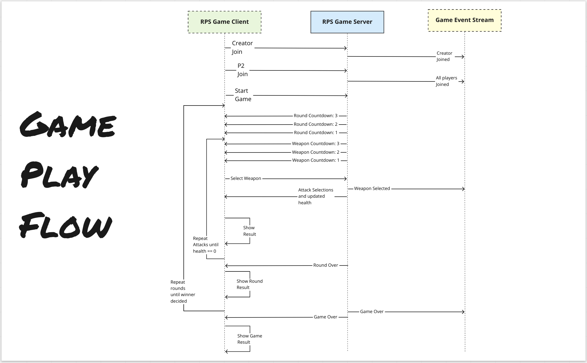

I've mentioned a few times how the game engine is shared between the client and server.

The `MultiPlayerGame` class in `game_server/game_handler.js` is what creates and runs the actual game logic. It is the server side equivalent of the client side `game_engine_interface` file we looked at on the client.

### The gameplay




***

## Player Input

In single player mode user input is easy. Players click with their mouse and we handle it. 

In multi player we need to send that click to the server and then send it out to the other player.

In the constructor of the `MultiPlayerGame` class you can see where we set up some functions to handle this.

```js
this.messageHandlers = {
  select_fighter: (conn, msg) => this.handleSelectFighter(conn, msg),
  start_battle: (conn, msg) => this.handleStartBattle(conn, msg),
  select_weapon: (conn, msg) => this.handleSelectWeapon(conn, msg)
}
```

The three entries in this `messageHandlers` object represent the different possible player inputs.

Players only really have two interactions with the game. They select a fighter and then choose between rock, paper and scissors on a loop.

`start_battle` is a message that clients send to signal that they are ready to fight. We need to do this so that we can sync up the beginning of the battle scene.

We won't go too deep on the rest of the code here as that warrants a course of it's own, and we will be back here once we get to the Matchmaker.

You should absolutely explore it yourself though, try get a sense of what is going on in there.
