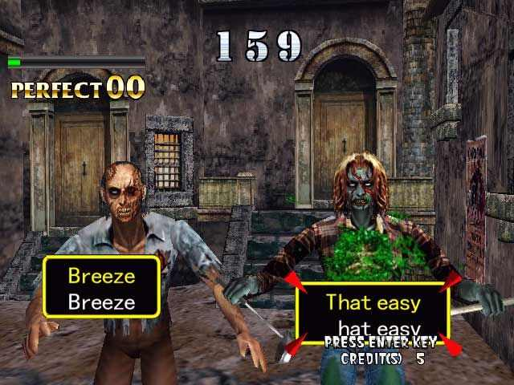

# Mouse and Keyboard

I'm going to go ahead and assume you know what a mouse and keyboard are and what they do. So you might be wondering why I'd bother writing a whole post about them.

Well, what I actually want to do is get you excited about your keyboard... and learn to despise your mouse. Maybe despise is too strong a word... Mice are great and absolutely have a place. But if you're going to be spending a lot of time with your computer, it's worth really getting to know your keyboard.

But why? You might ask.

Let's think about it for a second.

When you are sitting at your computer and writing some code or typing up a document, you will have both of your hands on the keyboard.

If you then want to use your mouse to do something, like change to a different window or select a menu option, you need to lift your hand off the keyboard and move it over to the mouse. Then you need to move that mouse so that your pointer moves to the desired location. Finally, you can click the thing.

This is slow, and more often than not you can avoid that hand relocation entirely by using keyboard shortcuts. The amount of information you can send to your computer through your keyboard vastly outweighs the information you can send via a mouse.

You just need to learn how to unlock the power of your keyboard.

## Touch Typing

`Touch Typing` is the ability to type without looking at the keyboard.

It's an invaluable skill and is worth spending some time on. I won't lie, it can be painful to learn, but there are plenty of tools online to help you improve your typing. My personal favourite is a version of the arcade shooter 'House of the Dead' called 'The Typing of the Dead', where you type words to fend off an incoming horde of zombies.

## Navigating Text

Since writing code is essentially manipulating a bunch of text files, it's definitely worth spending some time learning how to efficiently navigate a text file using just your keyboard.

### Shifting

The shift key on your keyboard is interesting. Most of the time, people use it purely for the purpose of capitalizing a letter. You hold shift, type a letter, and on the screen you will see the capital version of that letter.

But that is just one example of what Shift can do.

More generally speaking, what the shift key actually does is 'invert' the functionality of the operation you are performing.

Open up a text editor a type out a sentence, any sentence. Now use your arrow keys to move the caret (the little vertical bar that tells you where your text will be entered) around. Now try moving the caret around with the arrow keys, but this time hold down shift while you do it.

What happened?

Instead of just repositioning the caret, your computer will now highlight any letters in its path. If you press the up arrow, all of the text between where the caret started and ended up will be selected.

This is incredibly useful, especially when writing code. Later on, we will couple this functionality with some shortcuts to unleash some real power!

### Controlling

Another important key on your keyboard is `control` or `ctrl`. If you're using a Mac you will want to use the `Command` key for the most part (though in some cases, you will want to use the `option` key. I switch between a Mac and my Linux PC a lot - and it really messes me up because I have to rethink how I use the keyboard).

Anyway, using control you can really increase the speed with which you can move around in your text editor.

For example, in Windows/Linux if you hold control while using the forward / back arrow keys, the caret will jump around one word at the time. Combine that with the shift key and you will select each word as you jump over it.

!!! info
	On Mac you will need to use `option` to get this same behavior.

### Home and End

A couple of keys on the keyboard that don't get used often are the 'home' and 'end' keys.

Pressing `home` will move the caret to the start of the current line. Pressing `end` will move it to the end. Pressing shift while using either of these keys will, you've guessed it, highlight the whole line from the point where the caret started to either the start or end, depending on which key you hit.

!!! info
	On Mac you don't need home and end, `cmd + <arrow>` will do the same thing.

### Manipulation

Now let's put the above to good use and actually manipulate some text.

The most commonly used text manipulation shortcuts on a keyboard are probably:

* `ctrl + c` - copy the highlighted text

* `ctrl + x` - cut the highlighted text (like copy, but removes the text)

* `ctrl + v` - paste whatever you last copied or cut

* `ctrl + z` - undo the last change you made

* `ctrl + a` - select all text in your editor

!!! info
	On Mac use `Command` in place of `ctrl` for all of the above

So - now we can combine everything we've learned so far and enable some lightning fast text manipulation.

Let's say you have a few paragraphs of text, with your caret at the beginning.

If you want to delete the first line (on Windows) you can simply issue the following commands on your keyboard:

`shift + end` then `backspace`.

If you want to take the first line and move it to the very bottom of the text, simply do the following:

* `shift + end` to select the first line

* `ctrl + x` to cut the text out

* `ctrl + end` to jump to the end of the text

* `ctrl + v` to paste the text at the end

To really optimize this you don't even need to take your finger off the `ctrl` key once you've first pressed it.

If you tried to do the same with your mouse it would likely take a few seconds. Using the keyboard I can do all of this in less than a second. This time really adds up when you spend 8 hours a day at your computer for an entire career.

Something **really** important to note here is that just reading about these sorts of shortcuts and text manipulation tools really won't do you any good. You need to practice this. You need to force yourself to use these shortcuts - resist the urge to use your mouse. Even if you forget a shortcut, stop what you are doing it, go search the internet to figure it out and then do it.

After a while it will become second nature. While writing this post I used all of the above tricks to move bits of text around, select chunks of text to delete, and much more.

!!! info
	Note that these text manipulation shortcuts will work in any text field on your computer! So, for example, you can use all of the above when typing a URL into your browser.

## Shortcuts

We've already touched on a bunch of shortcuts, and they are exactly what their names suggest. Quick ways to achieve a desired result.

It's important to note that most applications you use will support what has become a fairly standard set of shortcuts. So `ctrl + z`, for example, will usually mean `undo`, no matter what application you are using. In a text editor, it will remove the last word or letter you typed. In an image editor, like Photoshop, `ctrl + z` will undo whatever the last change you made to the image was. 

You don't need to learn and memorize all of these commands now, that would be tedious and annoying, but you should be aware they are there. Every time you reach for the mouse think to yourself 'could I have done that faster with my keyboard?' The answer is probably yes.

### System Level

There are some shortcuts that exist at the level of your operating system that will be extremely useful as you begin to spend more time on your computer.

The one I use most is probably `alt + tab`. This will switch between whatever the two most recently active open windows are.

For example, if you have your browser open and you have a text editor open, `alt + tab` will switch between them.

If you have two windows of the **same** application open you can also switch between the two of those by using `` alt + ` `` (that is the key above your tab key).

!!! info
	On Mac you need to use the Command key for the above.

On Windows and Linux one of the more useful keys is the `Windows Key`. Usually this is between the `ctrl` and `alt` keys.

On my Linux machine this will display all currently open applications. On Windows it will open your start menu. Either way, you can push this button and start typing the name of the application you want and the system will find it for you.

On Mac you can achieve similar using `cmd + space`.

There are many more system level shortcuts you can explore yourself, these are probably the two I use most frequently myself. 

### Application Level

At the application level there are a few shortcuts you can probably count on being there.

For example:

* `ctrl + s` - save your changes
* `ctrl + q` - close the application
* `ctrl + n` - create a 'new' document, file etc...
* `ctrl + o` - open an existing file

Another useful trick is if you want to access the menu along the top of the window is you hold down the `alt` key. This should result in each word in the menu having a single letter underlined. You can then hit that key to open that menu. From there you can use your arrow keys to navigate around the menu.

For example, opening the 'File' menu usually involves using `alt + f`.

!!! info
	Mac OS doesn't have this exact functionality. You can use `ctrl + f2` to send focus to the menu bar at the top of the screen and go from there.

## Vim

Vim is a text editor that is popular among many programmers.

It is known for having an incredibly steep learning curve - but once mastered it can result in serious productivity gains. This is because it is set up to utilize only a keyboard (it has been around since before mice) and does this job amazingly well. Watching an experienced Vim using is like watching a sort of black magic ritual - files are created, modified and saved with speed and precision like you've never seen before.

I'm not going to get into Vim here because many books and tutorials have been written on this application that do a far better job than I ever could.

I just wanted to highlight it here because it is an extreme example of what you can do with just a keyboard.

If you're using Linux or MacOS and want to try out Vim you can do so by typing `vimtutor` in your terminal. This will open up a tutorial for you to get hands on with Vim right away (it is build into Linux and Mac). On Windows you can use a Linux VM (see the [Setup](/setup/) section of [Your Apprenticeship](/internship/)).

## In Closing

I could spend hours talking about keyboard shortcuts and efficiency - but I won't. What I wanted to do here was simply plant a thought. A thought that will sit there in the back of your mind and tingle ever so slightly every time you reach for your mouse.

'Could I have done that faster with my keyboard', it will say.

And I hope you will respond with curiosity, and go explore ways to make your workflows more efficient.

Remember, if you spend 10 seconds every hour doing something that you could do in 1 second, over the course of a 40 hour work week you will be wasting 6 whole minutes. Over the course of a year that will add up to 5 hours. Over the course of a career you're looking at 8 or 9 days! 
