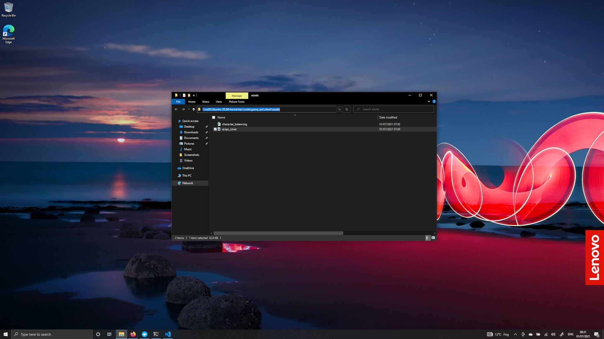

# Adding a game to Varcade Games

Navigate your browser to `localhost:8000/admin`.

You should be greeted by a login page. Use the credentials that you provided in the early step where you ran `./manage.py createsuperuser`.

Once logged in you should see a menu that looks like this:

Click the `add` link under the `GAMES` category. 

To start with we're going to add a game in the 'Coming Soon' state, which allows us to configure and view a game without actually needing to provide a playable game.

Fill in all of the fields with dummy data, for example:

* Game id: test_game
* Name: My Game
* Desc: A great game that you should play!
* Client url: placeholder_url
* Cover art: <See below\>
* Stats config: <See below\>
* Game type: SinglePlayerOnly
* Game State: Coming Soon

## Adding 'Cover Art' and 'Stats config'

There is some cover art we can use in the `rps_game` project. You will find this file in the `game_rps` project in the folder: `game_rps/client/assets/exrps_cover.jpg`.

In that same directory there is also a file called `exrps_stats.json`, you will need to upload that file in the `stats config` section of the admin panel.

### On Windows

This might be a bit confusing on Windows. 

The file we want to upload to our browser lives on our Ubuntu instance, so how do we actually access it from Windows?

In VSCode you can right click the image and select `reveal in file explorer`. This will open up a window showing the folder that contains the file.

At the top of the window is a path to the file:

Once you click the path it will turn into a text field that you can copy and paste:

Copy that path and then select the `browse` button in the admin interface. You can now paste the image page in the upload window that pops up and select the desired file:

Hit the save button and you're done.

***

## Viewing the game

All that's left is to head back over to `localhost:8002` and check out the game!

Still nothing exciting going on there because we can't actually play anything - but we have verified that the Game Portal is working correctly.

And that's it - you've successfully setup Varcade Games, so I guess we should talk about what to do next...
